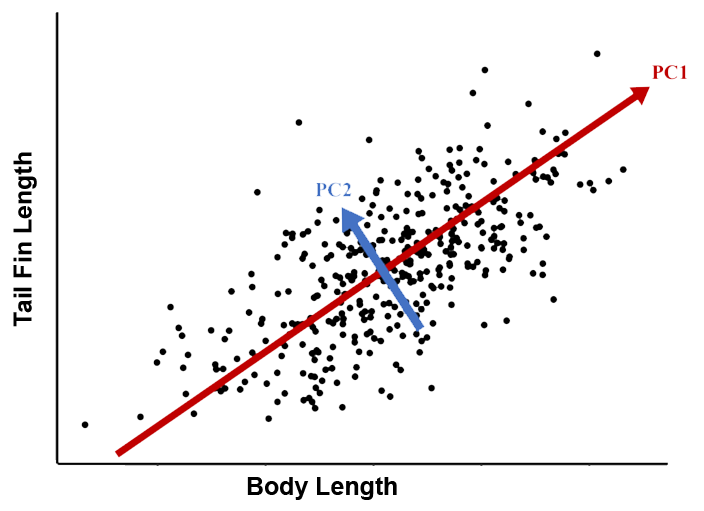

\newpage 

# Fundamentals

## Introduction

This chapter provides a rapid breakdown of the core functionality of R. There is a lot to cover in a very short time. You may be tempted to skip over some of these sections, but this chapter forms the foundation of future chapters. If you don't have a solid foundation, you will have trouble building your coding skills. Remember that you can only learn coding through repetition. Take the extra time and make the effort to type out each code and run it in your console. 

> **I can't stress this enough: It is important that you physically participate and code along with the examples. Type everything out. The physical act of typing into R and troubleshooting any errors you get is a crucial part of the learning process.**

It's very likely you will sometimes get a different result, such as a warning or error message. Don't get frustrated! Think of it as an opportunity to work on you debugging skills. Check to make sure you don't have any typos, like the letter `l` and the number `1`, or `\` vs `/`, or missing spaces or other changes that may be hard to spot visually. If you are getting a warning, read it carefully. 

<br> 

*** 

<br>

## R Basics

Make comments inside your code with the hash mark **`#`**. When you type this character, it tells the R program to ignore everything that comes after it.

Documentation is an important part of coding. It takes a bit of extra time to write, but it will save you a lot of time. Careful documentation will be essential when coding collaboratively, even if your collaborator is you when you wrote code six months back. 

It's ok to play around with code to get it working, but once you have a piece you are happy with, be sure to go back and add documentation.

Later, we will see how to use R markdown to provide more attractive documents for reproducible analysis. But for dedicated programs, you can get creative with characters to help make long documentation more readable:

```{r}
# Use hastags to make comments - not read by the R console
# Use other characters and blank lines to improve readability:
# ------------------------- 
# My first R script 
# Today's Date
# -------------------------
# Add a summary description of what the script does
# This script will...
# And annotate individual parts of the script
```

> Did you type this out? If not, you missed something important. Go back to the beginning of the book and read more carefully.

### Basic Math

You can do basic mathematical equations in R. Many of us choose to become biologists because we aren't comfortable with mathematical equations, only to find out later how important math is for biology! 
As we'll see later, coding can help to demystify mathematical equations. Let's start with some basics:

> *Yes, type these out!*

```{r}
10+2 # add
10-2 # subtract
10*2 # multiply
10/2 # divide
10^2 # exponent
```

> **Tip**: To get more practice, use R instead of your calculator app whenever you need to calculate something. It seems silly to go through the trouble to open R Studio to calculate a few numbers, but it will get you comfortable using R and R Studio, which will pay off in the long run..

### Objects & Functions

**Objects** and **functions** are the bread and butter of the R programming language. An object can take many forms, but is generally an input or output. This could include a letter or a number, or a set of letters or numbers, or a set of letters and numbers, or more structured types of objects that link together different kinds of information. 

Objects are manipulated with **functions**. Each function has a unique name followed by a set of parentheses, which are used to define input and **parameters** that are used by the function.

In fact, there is a function called `function()`. Yes, there is a function in R called *function*, and you can use it to write your own custom functions, but we'll save that for later.

For now, just remember that functions have brackets. Brackets are used to define input and parameters that the function uses to produce output. 

> **Warning**: Do not put a space between the function name and the opening bracket or you will generate an error.

### `c()`

The **concatenate** function `c()` is a very simple yet important and common function in R. Use it to group items together.

```{r}
c(1,2,3,5)
```

In this function, the numbers 1, 2, 3, and 5 are the input parameters.

The output is an **object** called a **vector** that contains four **elements**. The `c()` function takes four separate objects (elements) and combines them into a new object (vector). If this seems weird, take a few minutes to think it through because this difference will be important later.

Think of a vector as part of a row or column in a spreadsheet, and an element as one of the cells. We can also have more complex obects that are equivalent to entire spreadsheets, or a combination of multiple spreadsheets and other kinds of structured data.

### Math Functions

Here are some functions for common mathematical calculations. Type these out and then try channging some of the numbers in brackets to get a feel for them:

```{r}
abs(-10) # absolute value
sqrt(10-1) # square root (with subtraction)
log(10) # natural log
log10(10) # log base 10
exp(1) # power of e
sin(pi/2) # sine function
asin(1) # inverse sine
cos(pi) # cosine
acos(-1) # inverse cosine
tan(0) # tangent
atan(0) # inverse tangent
```

> Note that `pi` is a special object containing the digits of pi. Try typing `pi` in the R Studio Console and pressing **`Enter`**.

### Round/Truncate

We can use R for rounding and truncating numbers.

```{r}
round(pi, digits=3) # standard rounding to 3 digits
floor(pi) # round down to closest whole number
ceiling(pi) # round up to closest whole number
signif(pi, digits=2) # round to keep 2 significant digits
```

> **Pro-tip**: round() with digits=3 is a great function to use in your reports, manuscripts, theses, etc. 

Later, we'll look at how to generate reports that incorporate code (e.g. statistical analyses) that you can quickly update with new data. Rounding the output of your R code with round() makes for much cleaner, and more readable reports.

### Logic Operators

An **operator** is used to compare values. We'll use these a lot when we start writing our own custom programs and functions. It also comes in handy for sub-setting your data.

```{r}
1 > 2 # greater than
1 < 2 # less than
1 <= 2 # less than or equal to
1 == 1 # equal to
1 == 2 | 1 == 1 # | means 'OR'
1 == 2 & 1 == 1 # & means 'AND' 
1 == 1 & 1 == 1
```

We can also use`!` as a negation/inverse operator

```{r}
1 != 1 # not equal to
```

### Group Comparisons

Instead of the vertical bar character `|`, you can use `%in%` with `c()` to check a large number of values.

```{r}
1 %in% c(1,2,3,4,5,6,7,8,9,10)
```

### Congrats!

Before we move on to the next section, take a second to look back at all the coding skills you've already learned: documenting code, basic math, working with objects and functions, combining objects, some advanced math functions, and comparing objects. Well done! 

Seriously, you already know enough write your own R program! Try it!

  1. Make a new file: `File-->New File-->R Script`
  2. Write some code -- try to use as many concepts above as you can.
  3. Don't forget your documentation!
  3. Save the file
  4. Run the file and look at the output
  5. Debug your error and warning messages.
  6. Show off your program to your friends a family

You are a coder now! Let's take your skills to the next level.

## Use ? for HELP

Whenever you are learning a new function, you should use `?` and carefully read about all the parameters and outputs. The explanations can be a bit technical, which is intimidating at first. But after enough practice you will start to understand more and more of the descriptions. Let's break it down:

```{r eval=F}
?round
```

> **Note**: In R Studio, the help will open in a separate 'Help' tab (lower, right panel in the default view)

### Description

The description gives a general overview of the function. In this case, `round()` is one of a set of related functions, which are all described together in the same help file

### Usage

This shows the general form of the function. 

### Arguments

This explains the 'arguments' of the function, which are the input values and parameters. In the case of `round` the arguments include a numeric vector `x` as input and `digits` as a parameter.

### Value

This help doesn't have a **Value** subheading, but more complex functions do. For example, try `?lm` to see the help for linear models. Values are objects created by the function as output. For example, the model `coefficients` and `residuals` are separate objects of a linear model created by the `lm()` function.

### Details

This explains the function(s) in greater detail, and is worth reading the first few times you use a function

### Examples

This section gives examples as reproducible code, which you can copy-paste right into your terminal to try.

To conclude, always read the help **carefully** when you first use a function. It's normal to keep referring to the help every time you use a function that you aren't too familiar with. It's also normal that you might not understand everything in the help file. Just do your best and be persistent and over time it will start to make more sense to you. You will find these get easier as you read about more functions and try to apply whatever you can understand.

## Random Numbers

The ability to quickly and efficiently generate random numbers has a lot of useful applications for biologists. What are some examples?

  1. Generating random numbers for an experimental design
  2. Simulating 'noise' or stochastic processes in a population or other biological system
  3. Developing a null model for statistical significance testing
  4. Exploring 'parameter space' in a Maximum Likelihood model or a Markov Chain Monte Carlo simulation

It is very easy to generate some random numbers in R, from a variety of different sampling distributions. 

These are covered in more detail in the [Distributions Tutorial](https://colauttilab.github.io/RIntroStats/1_Distributions.html), which is part of a different book (R Stats Crash Course for Biologists). For now, we'll just focus on generating random numbers.

### Uniform

Perhaps the simplest random number is a whole number (i.e. no decimal) drawn from a **uniform distribution**, meaning that each number has an equal probability of being selected.

```{r}
runif(n=10, min=0, max=1)
```

> Note that your randomly chosen numbers will be different from the ones randomly chosen here.

The `runif()` function here uses 3 parameters: 
  
  1. `n` -- the number of random values to generate
  2. `min` -- the minimum value that can be chosen
  3. `max` -- the maximum value that can be chosen.
  
We'll talk more about parameters later.

### Gaussian

One of the most common random distributions in biology is the **Gaussian distribution** with a given `mean` and `sd` (standard deviation). Rational numbers (i.e. with decimal) closer to the mean are more likely to be chosen, with sd defining probability of sampling a value far above or below the mean value.

```{r}
rnorm(10, mean=0, sd=1)
```

> **Side note**: Look what we did here. We wrote `10` instead of `n=10` and the function still works! In fact, we can get away with:

```{r}
rnorm(10,0,1)
```

You can figure out the order by reading more detail about the function, but we'll get to that later. When you are starting out, it's a good idea to type the extra characters to specify the parameter names to avoid bugs in your code. It also makes the code more readable to others.

### Poisson

A **poisson distribution** includes only whole numbers with a parameter `lambda`, which is analogous to the mean in the normal distribution.

Poisson distributions are common for count data in biology -- seed or egg number, for example.

```{r}
rpois(10, lambda=10)
```

### Binomial

The **binomial distribution** is useful for binary outcomes -- variables with only two possibilities, which can coded as 0 or 1 (or true/false). The `size` parameter is the number of events (e.g. number of coin flips), and the `prob` parameter is the probability of getting a 1.

Binomial distributions are commonly used in population genetics (e.g. sampling alleles with different frequencies). 

```{r}

rbinom(10, size=1, prob=0.5) 
rbinom(10, size=10, prob=0.5)
```

### Other

Here are a few other random distributions you might be familiar with:

Distribution | R function
-------------|-----------
Chi-Squared | `chisq()`
t | `t()`
F | `F()`
Exponential | `exp`
Log-Normal | `Lognormal`
Logistic | `Logistic`

## `set.seed()`

**Fun fact**: random numbers generated by a computer are not truly random. Instead, the numbers involve a calculation from a starting number called a **seed**. The seed might be the current Year/Month/Day/Hour/Minute/Second/Millisecond, which means the 'random' number could be determined by somebody who knows the equation and the time it was executed. 

In practice, computer-generated random numbers are much more 'random' than numbers 'randomly' chosen by a human mind. 

We can also take advantage of a computer's pseudo-random number generation by setting the **seed** number. This can help with testing and debugging our code, and for writing code for research that is 100% reproducible. With the same seed, anyone can generate the exact same "random" numbers. We do this with the `set.seed()` function.

Compare these outputs:

```{r}
runif(5)
runif(5)
set.seed(3)
runif(5)
set.seed(3)
runif(5)
set.seed(172834782)
runif(5)
set.seed(172834782)
runif(5)
runif(5)
```

See how the same 'random' numbers are generated with the same seed?

# Combining objects

Returning now to the concatenation function, we saw how to use use `c()` to concatenate single objects.

```{r}
c(1,2,5)
```

We can also *nest* functions, for example we can use `c()` inside of another concatenate function.

```{r}
c(c(1,2,5),50)
```

If we need to concatenate a range of numbers, we can simplify with the colon **`:`**

```{r}
c(1:10)
c(100:90)
c(-1:1)
```

> **Question**: How could you use this to generate a set of numbers from -1.0 to 1.0 in increments of 0.1? You have all the coding knowledge you need to do this. You just have to try combining two of the things you have learned so far.

**Hint**: Think about how many elements should be in the vector, and what kind of math operation you could use.

## Sequence

Alternatively, you can also use `seq()` to generate more complicated sequences

```{r}
seq(-1, 1, by = 0.1)
seq(-1, 1, length=7)
```


## Rows and Columns

As noted above, the output of `c()` with two or more elements is a **vector** object that is conceptually similar to a set of rows or columns in a spreadsheet. 

Use `cbind()` to bind columns and `rbind()` to bind rows. The result is a two-dimensional **matrix**, which is conceptually similar to a spreadsheet of `n` rows by `c` columns. 

```{r}
cbind(1:10,10:1)
rbind(1:10,10:1)
```

> What are `n` (number of rows) and `c` (number of columns) for each of the above examples?

### Congrats, again!

Okay, let's take a quick breather from writing code. You have been typing along, right? If not, go back and type out the code. It really is so important if you want to learn this!

We are about to enter into the realm of **object-oriented programming**, but first we need to cover a few basic concepts.

<br>

*** 

<br>

## Data Types

Programming languages like R use different data types. 

It's very important to understand data types in order to properly encode and analyze data in R. Here is an overview of the main data types:

Type | Example | Description
--------|-------|----------------------------------
`string` |`"String"`| Strings are the most common and versatile data type. They can be defined with single `''` or double `""` quotation marks. The downside of strings is that you typically can't do mathematical functions with them.
`numeric` (**float**) |`12.421`| Numeric variables are numbers and come in a few flavours. Floats are rational numbers.
`numeric` (**integer**) |`12`| Integers are numeric objects that store whole numbers, and may be positive or negative (no decimal).
`complex` |`0+12.43i`| Complex numbers include real and imaginary numbers.
`logical` | `T` or `TRUE` | Logical (aka **Boolean**) variables are either `TRUE` or `FALSE`, which can be shortened to `T` and `F` (**Note** the use of capital letters only). NOTE: `TRUE` is a *logical* data type but `"TRUE"` and `'TRUE'` are *strings*.
`factors` | any | Factors are a special type of data that may include strings and/or numbers but have a limited number of classes. Factors are often used to code groups in statistical models. 

Note that computers cannot store irrational (i.e. infinite, non-repeating) numbers, instead they have encoded as fractions or equations and rounded to some (tiny) decimal place.

Why does it matter? It's very common to have errors in statistical analyses caused by the wrong kind of data. Here is a very common example of a big coding error in Biology: 

Imagine you have an experiment set up with three experimental groups coded as `1`, `2` and `3`. 

> **Question**: What data type should these be?

**Answer**: These should be coded and analyzed as **factors** NOT **numeric** variables. Running statistical anlayses in R on numeric objects that should be factors will give completely different (and wrong!) statistical results.

More generally, you should keep these data types in mind. Consider memorizing them, or even just printing or writing them out and pasting them on your wall. When you get to a point where you are collecting your own data or working with other data sources, you will need to think carefully about what data type each observation should be coded as. This is called **data coding** and it is one of the most important steps in any data analysis pipeline.

<br>

*** 

<br>

## Objects & Variables

R supports **Object-Oriented Programming (OOP)**, which is a programming style that defines and manipulates **objects**

An **object** in R can be a lot of things, but to understand some of the key objects, let's start by thinking about a spreadsheet (example Microsoft Excel). 

A spreadsheet has individual cells or elements (boxes) organized into rows (e.g., numbers) and columns (e.g., letters), and may have multiple sheets (tabs). Any of these can be coded objects in R. Objects can also be more complicated types of text files. In biology, we might have DNA (or RNA or protein) sequence data, or matrices of species community data, or time series, or the output of a statistical test. All of these can be coded as objects in R.

**Variables** are objects that can change value. In R, we use can assign variables using `<-` or `=`. Almost everything you need to know about R to be a prolific data scientist in biology involves manipulating object variables with functions!

### Cells (elements)

The most basic object is a single value. For example, a string:

```{r}
X<-"string"
```

> **Question**: Why no output? 

**Answer**: When we wrote: `X<-"string"` R created the object called **X**, so no output is produced.

There are a few options To see the contents of `X`:

```{r}
print(X)
paste(X)
X
```

`print()` Is most generic and versatile for providing feedback while running complex scripts (e.g. during loops, Bash scripts, etc)

`paste()` Converts objects to a string, we'll come back to this.

Generally `print()` or `paste()` are preferred over calling the object directly.

OR, we can put the whole thing in brackets, which saves a line of code:

```{r}
(X<-"string")
```

Which one should you use? It's ok to use the bracket methods for simple scripts and reports, but use `print()` for more complicated analysis pipelines, especially those that run through a scheduler on remote computers. 

### Vector 

A vector is a one-dimensional array of cells. This could be part of a row or column in our spreadsheet example.

Each cell within the vector has an 'address' -- a number corresponding to the cell ranging from $1$ to $N$, where $N$ is the number of cells.

The number of cells in a vector is called the **length** of the vector.

All items in a vector must be of the same data type. If you mix data types, then the whole vector will be formatted to the most inclusive type. For example, if you include a string with any other format, then the whole vector will be treated as a string:

```{r}
Xvec<-c(1.1829378, X, 1:10, "E", "Computational Biology", 100:90)
Xvec
```

Similarly, a vector containing integer and rational numbers is a vector of all rational numbers:

```{r}
c(1,2,3,1.23)
```

> **Protip**: A common problem when importing data to R occurs when a column of numeric data includes at least one text value (e.g.  "missing" or "< 1"). R will treat the entire column as text rather than numeric values. Watch for this when working with real data!

If you want to mix data types without converting them, you can use a **list** object, which is described later. But first we will need to get comfortable working with the more basic data types.

#### Subset a Vector

Each cell within a vector has a specific address. Just as text message with the correct email address can find its way to your computer, you can find an element in a vector using its address. Remember that in R, addresses start with the number $1$ and increase up to the total number of elements.

R uses square brackets `[]` to subset a vector based on the element addresses.

```{r}
Xvec[1]
Xvec[13]
Xvec[1:3]
```

### Matrices 

A matrix is a 2-D array of cells, equivalent to one sheet in a spreadsheet program. The `matrix()` function can convert a vector to a matrix.

```{r}
Xmat<-matrix(Xvec,nrow=5)
Xmat
```

Be sure to understand what happened here. Compare this `Xmat` object to the `Xvec` object, above. See how we have re-arranged the elements of a one-dimensional vector into a two-dimensional matrix? **Note**: these two objects need the same number of elements -- $1\times25$ for `Xvec` and $5\times5$ for `Xmat`.

#### Subset a Matrix

Did you notice the **square brackets** along the top and left side? Do you see how the **rows** have numbers *before* the comma and **columns** have numbers *after* the comma?

These show the address of each element in the matrix. We can subset with square brackets, just like we did with vectors. Since there are two dimensions, we need to specify two numbers using the syntax `[row,column]`.

For example, if we want to select the element from the 3rd column of the 1st row:

```{r}
Xmat[1,3]
```

Or leave it blank if you want the whole row or column:

```{r}
Xmat[1,]
Xmat[,3]
```

> **Protip**: Always remember "**rows** *before* and **columns** *after* the column: `[row,col]`


### Arrays

**Array** is a general term to describe any object with $N$ dimensions. We've already seen a few different examples:

|Dimension | Object Name |
|:--------:|:-----------:|
|0 | Cell |
|1 | Vector |
|2 | Matrix |
|3+ | Array |

In R you can build arrays by adding as many dimensions as you need using the `array()` function.

```{r}
Xarray<-array(0, dim=c(3,3,2)) # 3 dimensions
Xarray
```

Notice how 3rd dimension is sliced to print out in 2D. Another way to conceptualize this array is to think of two matrices with the same dimension (rows-by-columns). The element of each matrix can be addressed by its `[row,col]` but we need a third dimension do distinguish between the two matrices. You can see this in the output above each matrix: `,,,1` vs `,,,2`. Together, this array has three dimensions: `[row,col,matrix]`.

> **Question**: If we add a third matrix with the same number of rows and columns, how many dimensions would you need to pull out a specific cell element in R? What if there were 10 or 100 instead of three?

**Answer**: Three! In all cases, this is still a 3-dimensional array, and we can access any element as above: `[row,col,matrix]`. All we are changing is the matrix number from 2 to 3 to 10 to 100! 

Higher-order arrays are possible, but a bit tricky to read on a 2-dimensional screen, and very hard to conceptualize.

Here's an example of a six-dimensional array. 

```{r}
Xarray<-array(rnorm(64), dim=c(2,2,2,2,2,2))
```

Once you get the hang of it, it's easy to subset. Just think of each dimension, separated by commas.

```{r}
Xarray[1:2,1:2,1,1,1,1]
Xarray[1:2,1,1,1:2,1,1]
```

> **Question**: Why are these numbers not the same?

**Answer**: Look at the `array[]` function and compare to the 6-D array to understand how this works. Each function captures a different 2-dimensional subspace of the 6-dimensional array 

If these higher-dimension arrays are too abstract, don't worry. They are important for neural networks, machine learning, and multivariate data (e.g. quantitative genetics, community ecology). Luckily, most of what you need to know you can extrapolate from your intuition about 2-dimensional and 3-dimensional space. Just make sure you understand the similarities and differences among cells/elements, vectors and matrices before you moe on.

## Matrix Algebra

R is pretty handy for matrix calculations that would be very time-consuming to do by hand or even in a spreadsheet program.

As an example, let's create some numeric vectors that we can play with. First, a simple vector object called `X` containing the numbers 1 through 10. 

```{r}
X<-c(1:10)
X
```

Second, a vector called `Y` containing the numbers 0.5 to 5 in 0.5 increments. Note how we can do this using some simple math:

```{r}
Y<-c(1:10*0.5)
Y
```

### Basic Operations

Probably the most common calculation for these `X` and `Y` objects is just to cycle through each element of each vector and multiply them together. For example, if X is a vector of leaf length measurements and Y is a vector of leaf width measurements, then we might want to calculate leaf area by multiplying each length by its corresponding width. 

In R we just use the standard multiplication operator `*` on a vector, just like we would do for two individual numbers.

```{r}
X * Y
```

Addition, subtraction, division, and exponents are similar.

```{r}
X + Y
X / Y
X ^ Y
```

Just as we apply operators to vectors, we can also apply functions to vectors. When we do this, the same function is applied to each individual cell of the vector.

```{r}
log(X)
exp(Y)
```

### Matrix Multiplication

Vectors, matrices, and higher-order arrays have multiple elements. Because of this, there are more than one ways to multiply the elements in one object with the elements in the other. This is going to get a bit abstract but matrix multiplication has broad applications in biology, from gene expression and molecular biology to community ecology and image analysis.

There are more options than simply multiplying each corresponding element. For example, we can multiply each element in the vector `X` by each element in the vector `Y`. This will create a matrix. Let's make an example with the first 4 elements of `X` and the first 3 elements of `Y`.

#### Outer product. 

Another way to multiply together two vectors or matrices is to multiply individual elements in different combinations. In the outer product we work across columns of the first object, multiplying by rows of the second object. It's easier to understand by example:

```{r}
Z<-X[1:4] %o% Y[1:3]
Z
```

Note how the first column is each value of `X` (1-4) multiplied by the first value of `Y` (0.5), and the second column is multiplied by the second value of `Y` (1). Similarly, the first row is each value of `Y` multiplied by the first value of `X` (1), etc. What happens if we reverse the order?

```{r}
YoX<-Y[1:3] %o% X[1:4]
YoX
```

> **Question**: How does the `Z` matrix object differ from `YoX`?

**Answer**: We have switched the rows and columns, which is called a **transpose**

#### Transpose

In R, we can transpose matrices with the `t()` function

```{r}
t(YoX)
```

#### By convention

To multiply two vectors together with the outer product, we arrange the first vector as rows, and the second vector as columns, and then multiply each pair of values together to fill in the matrix.

We can extend this to multiply two objects that are 2-dimensional matrices instead of 1-dimensional vectors. However, this gets tricky for the outer product because instead of generating a 2-D matrix from two 1-D vectors, we will generate a 4-D array from the outer product of two 2-D matrices.

#### Dot Product

Another way to multiply two arrays is with the dot product. To do this, we multiply matrices we match the element of each **row** in the **first** object with each **column** in the *second* object, and sum them together: (e.g.  `X[1]*Y[1]+X[2]*Y[2]...`).

It's easy to extend from two vectors to two matrices, just by multiplying out elements in each row of the first object by elements in the second object.

```{r}
X %*% Y
sum(X*Y) == X %*% Y
```

#### Other Operations

There are a few other important matrix operations that are useful for biological data and modelling/simulations. The **cross-product** is a complicated formula that is easy to calculate in R

```{r}
crossprod(X[1:4],Z) # Cross product
```

```{r}
crossprod(Z) # Cross product of Z and t(Z)
```

The **Identity Matrix** is a special matrix with 1 on the diagonal and 0 on the off-diagonal. We can create it with the `diag()` function

```{r}
diag(4) # Identity matrix, 4x4 in this case
```

We can also use the `diag()` function on an existing matrix, to pull out all of the values on the diagonal, resulting in a vector

```{r}
diag(Z) # Diagonal elements of Z 
```

Some of these calculations can get a bit tricky -- especially when we move to 2D matrices instead of vectors. You'll want to consult or review a matrix algebra textbook if you are going to apply these, but that's getting too advanced for this book. For now, the important thing is just to know that these options are available if you need them in the future.

#### Matrix Math Summary 

Operator | Name
----|------------
`*` | Multiply elements
`%*%` | Dot Product
`%o%` | Outer product
`t()` | Transpose
`crossprod()` | Cross-product
`diag(4)` | Identity of 4x4 matrix
`diag(M)` | Diagonal elements of matrix M


## PCA

One popular use-case for matrix calculation is the principal components analysis (PCA). The PCA is covered in much more detail in the [PCA Tutorial](https://colauttilab.github.io/RIntroML/2_PCA.html) in the R Intro Stats for Biologists textbook. 

Briefly, PCA is a form of **supervised machine learning**. It uses matrix math to re-scale a bunch of **correlated** vectors (e.g. measurements) so that they can be mapped to an equal number of **independent** PC axes. For example, if you measure tail fin lengths and body lengths of 100 fish, then you can code the data as two vectors. These values will probably be correlated since bigger fish have bigger tails. We can re-scale these two *dependent* (i.e. correlated) vectors as two *independent* (i.e. uncorrelated) principal components.



In the above example, PC1 is a measure of larger fish, whereas PC2 is a measure of tail fin size relative to body size.

PCA and other ordination methods are widely used in biology, from community ecology and microbiome studies to morphometrics, population genetics, metagenomics and gene expression. Of course there are many applications outside of biology too! For now, just know that it is easy to run a PCA using the `princomp()` function. In most cases, we would want to scale the vectors to have a mean of 0 and standard deviation of 1. Equivalently, we can use the `cor=T` parameter to use the correlation matrix in the calculations.

```{r}
princomp(Z, cor=T) 
```

## Lists 

Matrices and higher-order arrays generally all have the same data type and sub-dimension. For example, if you want to combine two separate 2D matrices into a single 3-D array, then the individual matrices have to have the same number of rows and columns. They should also have the same data type, or else everything will be converted to the most inclusive type, as noted above.

Often we may want to link different types of information together while still maintaining their different data types. Think of a record in a database where you may have information about an organism's taxonomic classification (factors) height (numeric), weight (numeric), general notes and observations (string), number of scales (integer), and maybe a photograph (numeric matrix) and a DNA sequence (string vector). This wouldn't fit neatly into an array format. Instead, we can use a **list** object.

Lists are useful for mixing data types, and can combine different dimensions of cells, vectors, and higher-order arrays.

Each element in a list needs a name:

```{r}
MyList<-list(name="SWC",potpourri=Xvec,numbers=1:10)
MyList
```

> **Important**: Many of the statistical functions and other tools in R use list objects to store output. Taking some time now to think about how lists work will save time later when you need to interpret output of R functions.

### Subset

There are a few different ways to subset a list object. We can subset by name using the `$` character

```{r}
MyList$numbers # Use $ to subset by name
```

Or we can **slice** using square brackets.

```{r}
MyList[3] # A 'slice' of MyList
```

This is similar to the way we used `[]` in vectors and matrices BUT note the inclusion of the name `$numbers` at the top of the output. 

With lists, we have another option, to **extract** using double square brackets.

```{r}
MyList[[3]] # An 'extract' of MyList
```

> What's the difference between `[]` and `[[]]`?

This is a bit tricky, but if you invest some time now to understand, you will save yourself a lot of headaches troubleshooting error messages in your code. Do your future-self a favour and take some time to understand this...

First, Look carefully at the output above; notice how the `[]` includes `$numbers` but the `[[]]` includes only the values? This is important if you want to use the slice:

```{r, error=TRUE}
2*MyList[3]
2*MyList[[3]]
```

> Note the error generated in the first case

The second case is just a pure vector of numbers, that's why we can multiply each value by two. The first case is still connected to a list object, with the `$numbers` indicating that we are looking at the *numbers* element of the list. This is part of a larger object, so R returns an error when we try to multiply a number.

In other words, the `$numbers` heading is part of the sliced object created with `[]` but NOT the extracted object created with `[[]]`.

### Function Output

> **Protip**: Many analysis functions in R output as lists (e.g. statistical packages).

For example, the output of `princomp`:

```{r}
princomp(Z) 
names(princomp(Z))
princomp(Z)$center
princomp(Z)$scale
```

Look at the help `?princomp` and scroll down to the **Value** subheading. See how these corresponde to `names(princomp(z))`? These values are stored as a list object with each element corresonding to a part of the list object denoted by `$`.

## `print()` and `paste()`

As noted earlier, the `print` function is the go-to function for printing output to the user. The `paste` function is useful for combining things together. 

Paste is a versatile function for manipulating output:

```{r}
paste("Hello World!") # Basic string
paste("Hello","World!") # Concatenate two strings
```

Sometimes we need to convert numbers to strings. `paste` is an easy way to do this:

```{r}
paste(1:10) # Paste numbers as strings
paste(1:10)[4]
```

Note how each number above is a separate cell in a vector of strings.

Use `as.numeric` to convert strings back to numbers.

```{r}
as.numeric(paste(1:10)) # Convert back to numbers
```

We can also use the `collapse` parameter to condense a multi-cell vector into a single cell. Reading the help for new functions reveals a lot of great treasures like this!

```{r}
paste(1:10,collapse=".")
```

> **Question**: What happens if we paste objects of different length?

```{r}
paste(c("Hello","World"),1:10,sep="-") 
```

**Answer**: The shorter vector gets re-cycled until every element of the longer vector is pasted.

It is not uncommon to nest a paste function within a print function when communicating output in a more complex R script.

```{r}
print(paste("Hello",1:10,sep="-"))
```

This would be useful if you were running a program, maybe on a remote high-performance computer where you submit your jobs to a sceduler and you want your program to keep notes about its progress, or generate other notes or feedback. The output of `paste` is not shown on the screen if used inside of a loop, whereas the output of `print` is. More about loops below.

<br>

*** 

<br>


## External Files

So far we've done everything within the R environment. If we quit R, then everything we have made will be removed from memory and we'll have to start all over -- unless you are typing this out in a `.R` file that you made in R Studio. 

For larger projects and reproducible analysis, it is useful to save and load data from external files.

### Working Directory

The **working directory** is the place on your computer where R looks to load or save your files. You can figure out what your current working directory is with the `getwd()` function.

```{r, eval=F}
getwd()
```

**Note**: The output is specific to your computer, so it isn't shown here

### Absolute Path

The directory shown in `getwd()` is called an **absolute path**. A path is just computer jargon for the way you get to your working directory, like walking down a path in your computer, turning into the correct directory or folder each time until you reach your destination. The absolute means that it is a location that is unchanging. The problem, for reproducible research, is that the location is specific to your user profile on your computer.

You can set an absolute path with `setwd()`. Here's one example:

```{r, eval=F}
setwd("C:/Users/ColauttiLab/Documents")
```

> Did you type out the above line? You should if you have been following the instructions! If you haven't, go back to where you stopped and type everything out to reinforce it in your brain. Remember, going through and typing everything out is one of the most effective ways to learn to code. 

If you have been typing along, you should have an error message, unless you are working in Windows and for some reason have a *ColauttiLab* username. Now try changing to a different directory on your computer.

If you are a mac user, your directory is probably similar, but without the **`C:`**:

```{r, eval=F}
setwd("/Users/ColauttiLab/Documents")
```

Again, you will get an error unless you replace the above with a directory that exists on your own computer.

This is why you should NEVER USE ABSOLUTE PATH NAMES in your code. It is not reproducible code! 

Don't worry, there is a better way...

### Relative Path

In the **absolute path** example above, we first go to the **root** directory, which is the most basic level (or the C: drive in the case of Windows). From the root directory we first click on the **Users** folder, then the **ColauttiLab** folder, and finally the **Documents** folder.

In R, we can just provide a path name as text rather than clicking through all the different folders each time. But as we have seen, the problem with absolute path names is that they are often unique to each user. 

Instead of an absolute path, we should use a **relative path** in our code. The relative path in R is denoted with a period, often followed by a forward slash.

For example, if we have a folder called `Data` inside our `Documents` folder, and our current working directory is one of the two examples above, we can use a relative path name to set the `Data` folder as the working directory. Before you type this out, you should make a folder called `Data` inside of your current working directory, or else you will get an error.

```{r, eval=F}
setwd("./Data")
```

The **`.`** means *inside of my current directory* and the `/Data` means *move into the Data folder*. This is the coding equivalent of double-clicking the data Folder in your Windows File Explorer or Mac OS Finder.

Now try running this code:

```{r, eval=F}
getwd()
setwd("..")
getwd()
```

Compare the working directories. The **`..`** means *go to the parent directory* (i.e. directory containing the current working directory).

The neat thing about relative directories is that it makes it easy to share complex R code between Windows, MacOS and Linux/Unix. In fact, the syntax used by R is the same as Unix, GNU, and Linux. 

### R Studio Projects

Working with relative paths can get a little bit confusing, especially if you start using `setwd()`. A good way to avoid confusion is to make an R project in R Studio

`File-->New Project-->New Directory-->New Project`

Then make a name for your project and choose where you want to save it on your computer. 

Now quit R studio and look inside the new directory that you just created on your computer. You will see a file with the name of your project followed by `.Rproj`

This file is an R project file, and you can double-click on it to open the project. Now here's the cool part: Start R Studio by double-clicking the `.Rproj` *project file* instead of opening the *R Studio App* directly. This should open R Studio, but you will see that the project folder will be your default relative path, which you can check with `getwd()`.

There are lots of good reasons to do this, which become more obvious as you progress as a coder and start working on collaborative projects. For now, think of your project folder as your self-contained programming pipeline. In principle, you want to be able to send this file to somebody else to run on another computer without making any changes to the code. You can do this if you learn how to use relative path names.

### Import Data

Download this data file and save it in a directory called `Data` inside of your new project folder:

https://colauttilab.github.io/RCrashCourse/FallopiaData.csv

Now open the file with a text editor and take a look at it. 

The `.csv` suffix stands for 'Comma Separated Values'. This is really just a regular old text file with different columns separated by commas and different rows separated by each line of text (i.e. hit 'Enter' to add a new row). You can see this if you try opening the file in a simple text editor (e.g. Notepad for Windows or textEdit for MacOS).

> You can easily create a .csv by choosing the *Save As* or *Export* in most spreadsheet programs (e.g. MS Excel), and choosing CSV as the output format.

To import this data into R, we can use the `read.csv` command and save it as an object.  

Often we have column names as the first row, so we include the parameter `header=T` to convert the first row to column names. 

Data without column names would have data on the first row, so we would want `header=F` or else our first row of data would be treated as column names.

```{r,eval=F}
MyData<-read.csv("Data/FallopiaData.csv",header=T)
```

```{r,echo=F}
MyData<-read.csv(
  "https://colauttilab.github.io/RCrashCourse/FallopiaData.csv")
```

**Important**: In R, objects created by `read.csv` and other `read.?` functions are special objects called `data.frame` objects.


### `data.frame`

A `data.frame` is a special type of object in R that is similar to a 2D matrix, but with with additional indexing information for rows/columns of data. This format is partly why R is so useful for writing a quick, reproducible data analysis.

There are a number of useful functions for inspecting a `data.frame` object.

The indices used for column names can accessed with the `names()` function

```{r}
names(MyData)
```

There are also a number of functions to quickly inspect the data.frame:

1. Show the first six rows of data

```{r}
head(MyData) 
```

2. Show the last six rows

```{r}
tail(MyData) 
```

3. Check the dimension -- the number of rows and columns

```{r}
dim(MyData) 
```

4. Check the number of rows only

```{r}
nrow(MyData) 
```

5. Check the number of columns only

```{r}
ncol(MyData) 
```

6. Interrogate the **structure** of the data

```{r}
str(MyData) 
```

We can use this to see column headers, types of data contained in each column, and the first few values in each column.

> **Protip**: `str()` is also useful for inspecting other objects, like the output of functions used for statistics or plotting


Pay careful attention to integer `int` vs numeric `num` vs `factor` columns in the `str()` output. These are the data types assigned to each column. As noted earlier, a common source of error students make when starting to analyzing data is using the wrong data *type*.

Here's an example of data types gone rogue: In an analysis of variance (ANOVA), you want a `factor` as a predictor and a `num` or `int` as a response. But in linear regression you want `int` or `num` as a predictor instead of `factor`. If you code your factor (e.g. treatment) as a number (e.g. 1-4) then R will treat it as an integer when you import the data. When you run a linear model with the `lm` function, you will be running a regression rather than ANOVA! As a result, you will estimate a slope rather than the difference between group means.

#### Summary

Always check your data types (e.g. using `str`) when you first import the data.

### Subset

The `data.frame` object can be subset, just like a matrix object.

```{r}
MyData[1,] # Returns first row of data.frame
MyData[1,1] # Returns first value of data.frame
```

In addition to numbers, you can subset a column by its header.

```{r}
MyData[1:4,"PotNum"] # Returns values in "PotNum" column
MyData$PotNum[1:4] # A shortcut to subset the column
```

Note how we also include 1:4 to show only the first 4 elements, which reduces the output to a more manageable level. If you aren't sure why, try running the above without 1:4 to see the difference.

We can also subset the data based on particular row values. For example, we can find only the records in the *extreme* treatment scenario.

```{r}
subset(MyData,Scenario=="low") # Subset
```

### New Columns

It's easy to add new columns to a data frame. For example, to add a new column that is the sum of two others:

```{r}
MyData$NewTotal<-MyData$Symphytum + MyData$Silene + MyData$Urtica
names(MyData)
```

Notice the new column added to the end. Let's look at the first 10 values:

```{r}
print(MyData$NewTotal[1:10])      
```


<br>

*** 

<br>


## Other Functions

There are a few more useful functions for inspecting your data.

### `unique`

Find all the unique values within a vector using `unique`.

```{r}
unique(MyData$Nutrients)
```

### `duplicated`

Look at each value in a vector and return a `TRUE` if it is duplicated and `FALSE` if it is unique.

```{r}
duplicated(MyData$Nutrients)
```

### `aggregate`

Quickly calculate means of one column of data (`NewTotal`) for each value of another column with groups (`Nutrients`).

```{r}
aggregate(MyData$NewTotal,list(MyData$Nutrients), mean) 
```

The `~` provides an alternative way to write this function. In R the `~` usually means *by* and it is often used in statistical models. 

```{r}
aggregate(NewTotal ~ Nutrients, data=MyData, mean)
```

For the code above, we can say "aggregate `NewTotal` *by* `Nutrients` grouping".

The nice thing about doing it this way is that we preserve the column name. Compare the column names here: *Nutrients* and *NewTotal*, vs above: *Group.1* and *x*.

We can also use this to calculate means across different combinations of two or more grouping columns.

```{r}
aggregate(NewTotal ~ Nutrients*Taxon*Scenario, data=MyData, mean)
```

Note that `mean` is just the `mean()` function in R. We can use other functions, like the standard deviation `sd`:

```{r}
aggregate(NewTotal ~ Nutrients, data=MyData, sd) 
```

### `tapply`

`tapply` works similarly, but using a `list()` function 

For example, we can calculate means of each `Nutrients` group:

```{r}
tapply(MyData$NewTotal, list(MyData$Nutrients), mean)
```

Compare this output with `aggregate` above. Here, the groups are the column names.

### `sapply` & `lapply`

The `sapply` and `lapply` functions are similar in principle to `tapply`, but are used to apply a function repeatedly and output the result as a vector (`sapply`) or list object (`lapply`). 

Here's an example, where we can summarize the `class` of each column in our `data.frame`

```{r}
lapply(MyData, class)[1:3]
sapply(MyData, class)[1:3]
```

Compare the above with:

```{r}
class(MyData)
class(MyData$Taxon)
```

## Tidyverse

Most of the methods above for managing and summarizing data are the *classic* or *base R* functions. More recently, the **tidyverse** group of functions has gained popularity and these functions have a lot of advantages over the classic tools, particularly for complex data management. 

For example, it is easy to string together multiple steps into a single 'pipe' of data reorganization. The [Data Science Tutorial](https://colauttilab.github.io/RCrashCourse/5_datascience.html)/Chapter introduces the `dplyr` package as an introduction to the `tidyverse`.


## Save

Just as we can load FROM external files, we can save TO external files. We just change `read` to `write`. For a CSV file:

```{r, eval=F}
## Calulate means
NutrientMeans<-tapply(MyData$NewTotal,list(MyData$Nutrients),mean)
## Save means as .csv file
write.csv(NutrientMeans,"MyData_Nutrient_Means.csv", row.names=F)
```

> NOTE: the default for write.csv adds a column of row names (i.e. numbers) to the output file. To avoid this, use row.names=F

You should see a file called *MyData_Nutrients_Means.csv* in your working directory.

### Output Foler

Larger projects may generate a lot of different output files, which you may want to organize in an `Output` folder inside of your project folder. Saving to this folder is easy for relative path names, just add `./Data/` before the file name in your `write.csv()` function. Just make sure the folder exists before you try to save to it!

```{r, eval=F}
write.csv(NutrientMeans,"./Data/MyData_Nutrient_Means.csv", row.names=F)
```


<br>

*** 

<br>

## Flow control

Think of your data analysis as a stream flowing from the raw data at the headwaters down to the river mouth, exiting as a full analysis with graphics, statistical analyses, and biological interpretation.

There are different ways we can control the flow of the water. The simplest is just to write a sequence of lines of code, with the output of one line of code forming the input of the next. A pseudo-code example might be:

```
A<-functionA()
B<-functionB(A)
C<-functionC(B)
```

But sometimes we may want to do the same function or analysis only if the input meets certain criteria. Or we may want to reiterate the same analysis multiple times on different inputs. This is where more advanced flow control comes in handy.

To start, let's make up a couple of objects to play with:

```{r}
X<-21
Xvec<-c(1:10,"string")
```

### `if`

The `if` statement uses an **operator** (see above) to asses whether the value is `TRUE` or `FALSE`:

```{r}
if(X > 100){ # Is X greater than 100?
  print("X > 100") # If TRUE
} else { 
  print("X <= 100") # If FALSE
}
```

A common 'rookie' mistake is to leave out a bracket or use the wrong type of bracket. Use regular brackets for the *if function* `if()` followed by two sets of curly brackets containing the code to run `{run if true}else{run if false}`. 

Break up across multiple lines to improve readability. Note that you don't need an `else{}` part if you just want to do nothing when `FALSE`.

```{r}
if(X > 0){print ("yup")}
```

### ifelse

The `ifelse` is a more compact version for simple comparisons. The following code does the same as above.

```{r}
ifelse(X > 100,"X > 100", "X <= 100")
```

### nested if

You can also nest `if` and ifelse` statements to account for more outcomes. Conceptually think of it as a bifurcating tree, starting at the top (root) and then splitting in two for every if statement.

```{r}
if(X > 100){
  print("X > 100")
  if(X > 200){
    print("X > 200")
  }
} else {
  if(X == 100){
    print("X = 100")
  } else {
    print("X < 100")
  }
}
```

Don't get intimidated. It just takes time to work through all of the possibilities. Try to draw a bifurcating diagram to represent each true/false outcome for the above code.


### `for` loop

A loop does the same thing over and over again until some condition is met. In the case of a `for` loop, we set a 'counter' variable and loop through each value of the counter variable. Here are a few examples:

1. Loop through numbers from 1 to 5

```{r}
for (i in 1:5){
  print(paste(X,i,sep=":"))
}
```

2. Loop through the elements of a vector directly

```{r}
for (i in Xvec){
  print(i)
}
```

3. Use an index object to index the elements of a vector

```{r}
for (i in 1:length(Xvec)){
  print(Xvec[i])
}
```

Note that in each case there is a vector and we loop through each cell in the vector. The `i` keeps track of the cell value in each iteration of the loop.

Loops can be tricky, and the only way to really learn them is to practice as much as possible. Whenever you find yourself writing similar code more than 2 or 3 times, challenge yourself to try to re-write it as a loop.

In addition to looping through a vector, it can often be useful to include a counter variable. This can be especially useful for more complicated loops, but one important thing to watch out for is what part of the loop you want to update the counter variable. USUALLY it will be either 

1. At the end, by setting the initial value to 1 before the loop gegins

```{r}
count1<-1
count10<-1

for(i in 1:5){
  print(paste("count1 =",count1))
  print(paste("count10 =",count10))
  count1<-count1+1
  count10<-count10*10
}
```

2. At the beginning, setting the initial value to 0

```{r}
countbefore<-0
countafter<-0

for(i in 1:5){
  countbefore<-countbefore+1
  print(paste("before =",countbefore))
  print(paste("after =",countafter))
  countafter<-countafter+1
}
```

Read through the outputs above carefully to make sure you understand how the loops work. When you are confident you understand, then write a new loop and write down the predicted output. Run the loop to check if you were right.

### Nested Loops

Counters are particularly valuable when you have a nested loop, which is just one loop inside of another.

In the example below, we are first looping through a vector of length 3, tracked with `i`. Then **for each i** we do a second loop, tracked by `j`.

This time, try to predict the output BEFORE you run the loop. Write it down, then run the loop to check your answer.

```{r}
LoopCount<-0
for(i in 1:3){
  for(j in 1:2){
    LoopCount<-LoopCount+1
    print(paste("i = ",i))
    print(paste("j = ",j))
    print(paste("Loop =",LoopCount))
  }
}
```


### `while` loop

The `while` is another kind of loop, but instead of looping through a predefined set of variables, we iterate until some condition is met inside of the loop. This is called the **exit condition**.

Often, the `while` loop is used in optimization algorithms, where many calculations are run until some optimum or threshold value is reached.

One common coding error associated with `while` loops is that the exit condition is never reached, causing your computer to run an infinite loop.

Here's a simple while loop, which will continue until `count` is greater than or equal to `X`.

```{r}
count<-0
while (count < X){
  print(count)
  count<-count+1
}
```

## Packages

As noted above, **functions** in R use brackets `()` and generally have **input** and **output** objects as well as **parameters** that affect their behaviour.

All of the functions in this tutorial are automatically loaded when you start R, but there are many more functions available. For example, our lab developed the `baRcodeR` package for creating unique identifier codes with printable barcodes and data sheets to help with sample management and data collection. You may find this helpful for labelling and tracking samples in your own work: https://doi.org/10.1111/2041-210X.13405

A **package** in R is a set of functions grouped together. For example, the `stats` package is automatically loaded when you run R and contains many useful functions. You can see what package a function belongs to at the beginning of the help file:

```{r, eval=F}
?cor
```

The package is shown in curly brackets at the top of the help file. In this case, we see *cor {stats}* telling us that the `cor` function is part of the `stats` package. You can see which packages are loaded if you click on the **Packages** tab in **R Studio** (by default it is in the bottom-right window). The loaded packages are shown with check marks. 

### Installing

There are many more packages available that are not yet installed on your computer. You will need to install a new package before you can use it. You only have to do this once, but it is a good idea to update the package frequently, especially when you update to a new version of R. This ensures that you are using the most recent version of the package.

Packages are installed with `install.packages()`, with the package indicated with single or double quotation marks. When you run this code may be prompted to choose a repository, in which case choose one that is geographically close to you.

```{r, eval=F}
install.packages('baRcodeR')
```

Note that **installing** a package just downloads it from an online **repository** (remote computer) and saves to your personal computer.


### Loading

To use a package that you already have installed, you can access it two ways. 

1. You can load the package using the `library()` function, giving you access to all of the functions contained within it:

```{r, eval=F}
library(baRcodeR)
make_labels()
```

This method is more common, especially when you will use multiple functions from the same package, or use the same functions multiple times.  

2. You can use **`::`** to call a function without loading the whole package

```{r, eval=F}
baRcodeR::make_labels()
```

This translates to *Run the `make_labels` function from the `baRcodeR` library*. This method is convenient if you just want to use one function from a large library.

Another reason to go with the second method is that some packages have **functions with the same names**. Let's say you load two packages `pkgA` and `pkgB` that have different functions but both are called `cor`. When you run the `cor` function, R will assume you want the one from whichever package  was most recently loaded using the `library()` function. 

To avoid confusion, you can use the second method to specify which function to run:

```{r, eval=F}
pkgA::cor()
pkgB::cor()
```


#### Library vs Package

The terms **library** and **package** are often used interchangeably. Technically, the **package** is the collection of functions whereas the **library** is the specific folder where the R packages are stored. A library may contain more than one package.

For the most part, you just need to know that a package and a library are a collection of functions.

## Readable code

Now that you've learned how to code, let's take a few minutes to think about best practices. It's important to make your code readable and interpretable by collaborators, peer reviewers, and yourself 6 months from now. There are lots of opinions on this but here are a few basic suggestions:

  1. Add documentation to explain what you are doing
  2. Add spacing between parameters to improve readability
  3. Add spacing on either side of `<-` when making objects
  4. Break long functions into multiple lines; add the line break after a comma
  5. Follow these additional suggestions for object/column/file names  
    a. Try to keep your names short and concise but meaningful  
    b. Use underscore `_` to improve readability  
    c. Always start object names with a letter, never a number or symbol
    d. Avoid symbols completely  
    
Bad | Good
------------|---------------
`sum(X,na.rm=T)` | `sum(X, na.rm=T)`
`X` | `Mass`
`Days.To.First.Flower` | `Flwr_Days` or `FDays`
`10d.Height` | `Ht10d`
`Length*Width` | `LxW`

Break up longer code across multiple lines:

Bad:

```{r,eval=F}
MyObject<-cor(c(1,2,NA,5,9,8,1,2,5,2,6,3),c(2,2,6,3,6,8,3,NA,2,4,5,1),...)
```

Good:

```{r,eval=F}
MyObject <- cor(c(1,2,NA,5,9,8,1,2,5,2,6,3),
                c(2,2,6,3,6,8,3,NA,2,4,5,1),
                method="spearman", na.rm=T)
```

To take your code to the next level, look into the [Tidyverse Style Guide](https://style.tidyverse.org/index.html)

<br>

*** 

<br>

