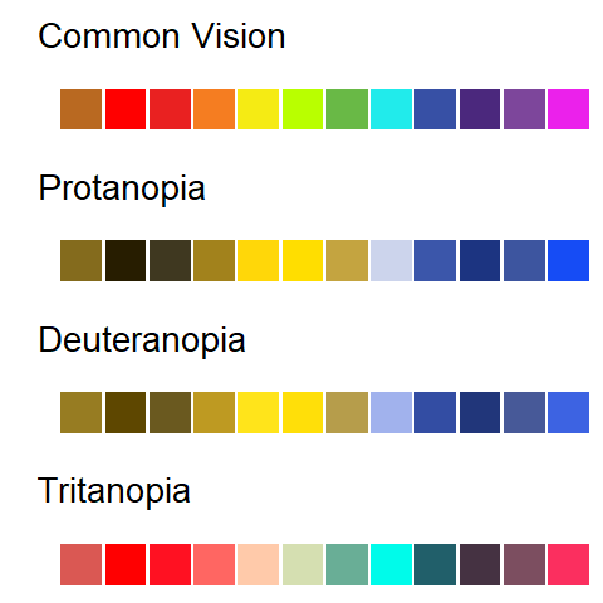

\newpage


# Quick Visualizations

## Overview

Visualizing data is a key step in any analysis. R provides powerful and flexible graphing tools, whether you are just starting to understand the structure of your data, or polishing off the perfect figure for publication in a 'tabloid' journal like [Science](https://www.science.org/journal/science) or [Nature](https://www.nature.com/).

In this tutorial, you will learn how to make quick graphs with the `ggplot()` function from the `ggplot2` package. We will go over some options for customizing the look and layout that will allow you to produce professional-grade graphs. In the next chapter you will learn some additional tricks and resources for developing your graphing skills even further.

By the time you are finished these two self-tutorials, you will have all the resources you need to make **publication-ready graphics**! 

Both `ggplot` functions come from the [`ggplot2`](https://ggplot2.tidyverse.org/) package. Developed by Hadley Wickham and the same team as R Studio, `ggplot2` is part of the [Tidyverse](https://www.tidyverse.org/) group of helpful R packages. 

> **Note** I don't know what happened to ggplot1...

Once you have mastered these tutorials, you might want to continue to expand your `ggplot` repertoire by reading through additional examples in the `ggplot2` documentation http://docs.ggplot2.org/current/

**WARNING**: There is a learning curve for graphing in R! Learning visualizations in R can feel like a struggle at first, and you may ask yourself: *Is it worth my time?* 

If you already have experience making figures with point-and-click graphics programs, you may ask yourself: *Why deal with all these coding errors when I can just generate a quick figure in a different program?* 

There are a few good reasons to invest the time to get over the learning curve and use R for all your graphing needs.

  1. You will get much faster with practice.
  2. You have much more control over every aspect of your figure.
  3. Your visualization will be **reproducible**, meaning anyone with the data and the code can reproduce every aspect of your figure, from each individual data point down to the specific axis labels.

The third point is worth some extra thought. Everybody makes mistakes, whether you are graphing with R or a point-and-click graphics program. If you make a mistake in a point-and-click program, you may produce a graph that is incorrect with no way to check! If you make an error in R you will either get an error message telling you, or you will have reproducible code that you can share with somebody who can check your work -- even if that *somebody* is you, six months in the future. In this way, **reproducibility is quality** -- a nice looking but non-reproducible figure is a low-quality figure.

In addition to quality and scientific rigour, there is a more practical reason to value reproducible code. Consider what happens as you collect new data or find a mistake in your original data that needs to be corrected. With a point-and-click program you have to make the graph all over again. With R, you just rerun the code with the new input and get the updated figures and analyses! Later, we will learn how to incorporate code for figures along with statistical analysis into fully reproducible reports with output as `.html` (Website), `.pdf` (Adobe Acrobat), and `.docx` (Microsoft Word)

## Graphical Concepts

Before we dive into coding for visualizations, there are a few universal graphing concepts that are important to understand in order to create publication-ready graphics in R: file formats, pixel dimension, screen vs print colours, and accessibility.

### Vector vs. Raster

There are many different **file formats** that you can use to save individual graphs. Each format has a different suffix or extension in the file name: .jpg, .png, .pdf, etc. Once saved, you can send these to graphics programs for minor tweaks, or you can send them directly to academic journals for final publication.

Importantly, file formats for visualizations fall into two main classes: **Raster** and **Vector**.

**Raster** files save graphs in a 2-dimensional grid of data corresponding to pixel location and colour. Imagine breaking up your screen into a large `data.frame` object with each pixel represented by a cell, and the value of each cell holding information about the colour and intensity of the pixel. You are probably quite familiar with this 'pixel art' format if you've ever worked with a digital photo or played a retro video game made before 1993. Some popular Raster file types include *JPEG/JPG, PNG, TIFF, and BMP*.

**Vector** files save information about shapes. Instead of tracking every single pixel, the data are encoded as colourd points mapped onto a two-dimensional plane, with points connected by straight or curved lines. To generate the image, the computer must plot out all of the points and lines, and then translate that information to pixels that display on your screen.

If you've ever drawn a shape in a program like Microsoft Powerpoint or Adobe Illustrator, you might have some sense of how this works. Some popular vector formats include *SVG, PDF, EPS, AI, PS*.

**So, why does this matter?**

In most cases, you should save your visualizations as **vector** files. *SVG* is a good choice, because it can be interpreted by web browsers and it is not proprietary. *PDF* and *EPS* are commonly used by publishers and can be viewed on most computers after insalling free software. 

Saving your graphs as a *vector* format allows you (or the journal proof editor) to easily scale your image while maintaining crisp, clear lines. This is because the shapes themselves are tracked, so scaling just expands or contracts the x- and y-axes.

In contrast, if you expand a *raster* file, your computer has to figure out how to expand each pixel. This introduces blurriness or other artifacts. You have seen some images that look 'pixelated' -- this happens when you try to expand the size of a lower-resolution figure. This also happens when a program compresses an image to save space -- the computer program is trying to reduce the data content by reducing the dimensionality of the image. 

In summary, **vector** images are generally a better format to use when saving your figures because you can rescale to any size and the lines will always be clean and clear. There are a few important exceptions, however.

  1. **Photographs** -- Photographs captured by a camera are saved in the *Raster* format and cannot be converted to vector without significant loss of information.
  2. **Grid Data** -- Raster data are convenient for plotting data that occurs in a grid. This includes most spatial data that is broken up into a geographic grid. However, you may often want to use the vector format for mapping/GIS data so that the overlapping geographical features (e.g. borders, lakes, rivers) remain in the vector format, even if an underlying data layer is a raster object (e.g. temperature in 1km squares).
  3. **Large Data** --   With some large data applications (e.g. 'omics' datasets) a graph may have many millions or billions of data points or lines. In these cases, the **vector** file would be too big to use in publication (e.g. several gigabytes). In this case you might opt for a high-resolution *Raster* file. On the other hand, you could graph your data using a density grid with colours corresponding to the density of points. In this case, you could use the *vector* format to maintain clean lines for the graph axes and labels.
  
*The bottom line*: you generally want to save your graphics as *SVG* or *PDF* files if you plan to publish them.

### Resolution vs Dimension

In cases where you do need to use raster images in a publication, pay careful attention to the image's **Pixel Dimension**. You have probably heard about image *resolution*: For example, a 2 megapixel camera is better than a 1 megapixel camera; a 200 dpi (dots per inch) printer is better than 100 dpi. But when creating and saving raster images, it's not just the **resolution** that matters, the image **size** also determines the quality of the final image. The **size** and **resolution** of an image jointly determine its **Pixel Dimension**. 

> For example, an image with 200 dpi that is 1 x 3 inches will have the same pixel dimension of an image with 100 dpi that is 2 x 6 inches. These images will look exactly the same if they are printed at the same size. The pixel dimension, not the resolution *per se*, determines how 'clean' vs pixelated an image looks.

### Screen vs Print

Another important consideration is the intended audience and whether they will likely view your figures on a computer screen or printed page (or both). Each pixel of your screen has tiny lights that determine the specific colour that is reproduced. The pixels *emit* different wavelengths from your screen, which overlap in our eyes to produce the different colours that we see. In contrast, printed images get their colour from combinations of ink, which *absorb* different wavelengths of colour. This is a key distinction! One important consequence of this difference is that your computer monitor can produce a broader range of colours and intensities than a printed pages, and therefore some colours on your computer monitor can look very different in print. In print, the intensity of colours are limited by the intensity of the Cyan, Magenta and Yellow inks that are used to reproduce the images. This is called **CMYK printing**.

Some programs like *Adobe Illustrator* have options to limit the screen to display only those colours that can be reproduced with CMYK printing.

### Accessibility

Another important consideration about your choice of colours involves your audience. Remember that many cultures have particular intuitions about colours that can cause confusion if your choice does not match these expectations. For example, in Western European cultures, the red spectrum colours (red, orange, yellow) are often associated with 'hot' or 'danger' while blue spectrum (blue, cyan, purple) are more associated with 'cold' or 'calm'. Imagine how confusing it would be to look at a weather map that used blue for hot temperatures and red for cool temperatures.

In addition to **cultural biases**, a significant portion of the population has some form of **colour-blindness** that limits their ability to see certain colours. This article in Nature has a good explanation with tips for making inclusive figures:
https://www.nature.com/articles/d41586-021-02696-z

Here is a simulation of colour blindness, written in R. Note how certain reds and blue/purple are indistinguishable. A good strategy is to use different **intensity** as well as different **spectra**. 



There is also a more practical reason for this. It is common for scientists and students to print your manuscript or published article in black-and-white to read on public transit or during a group discussion. If you choose colours and shading that can be interpreted properly in black and white, then you will avoid confusion with this significant portion of your audience. 
The `viridis` package is a good tool for this. See: https://cran.r-project.org/web/packages/viridis/vignettes/intro-to-viridis.html

### Slides

Some of the above information is covered and expanded in the *Introductory Slides*: https://colauttilab.github.io/RCrashCourse/Graphics_small.pdf  

These slides cover: 

  1. Graphing examples
  2. Graphical concepts
  3. `ggplot` grammar
  4. anatomy of a `ggplot` graph
  

## Getting Started

Install the `ggplot2` package using the `install.packages()` function the first time you want to use it. This installs it on your local computer, so you only need to do it once -- though it is a good idea to re-install periodically to update to the most recent version. 

```{r, eval=F}
install.packages("ggplot2")
```

Once it is installed, you still need to load it with the `library` function if you want to use it in your code.

```{r}
library(ggplot2)
```

### Data setup

We will again be working with the `FallopiaData.csv` dataset, which can be downloaded here: https://colauttilab.github.io/RCrashCourse/FallopiaData.csv, and saved to a folder called `Data` inside your project folder. Remember that you can find your current working folder with the `getwd()` function.

Now load the *.csv* file into R as a `data.frame` object:

```{r, eval=F}
MyData<-read.csv("./Data/FallopiaData.csv", header=T)
```

Alternatively, you can load the file right from the internet:

```{r}
MyData<-read.csv(
  "https://colauttilab.github.io/RCrashCourse/FallopiaData.csv")
```

This dataset comes from the research group of Dr. Oliver Bossdorf at the University of Tuebingen in Tuebingen, Germany -- a historic university in wonderful little town on the Neckar River. Let's inspect the `data.frame` that was created from the data, to see what kind of data we are working with.

```{r}
str(MyData)
```

The data come from a plant competition experiment involving two invasive species from the genus *Fallopia*. These species were grown in planting pots in competition with several other species. The first four columns give information about the pot and treatments (`Taxon` = species of *Fallopia*. The rest give biomass measurements for each species (header = Genus names). 

<br>

***

<br>

## Basic Graphs

Think back to the previous Chapter, and you will hopefully recall the different data types represented by the columns of our data. For graphing purposes, there are really just two main types of data: **categorical** and **continuous**. Putting these together in different combinations with `ggplot()` gives us different default graph types. 

Each `ggplot()` function requires two main components: 

  1. The `ggplot()` function defines the input data structure. this usually includes a nested *aesthetic* function `aes()` to define the plotting variables and a `data=` parameter to define the input data.
  2. the `geom_<name>()` function defines the output geometry
  
Note that the `<name>` denotes a variable name that differs depending on the geography used to map the data. This is covered in more detail in the next chapter. For now, we'll look at the most common *geoms*, based on input data type. 

Let's look at the defaults for one or two variables of categorical or continuous variables.

### One Continuous

Usually when we only have a single continuous variable to graph, then we are interested in looking at the frequency distribution of values. This is called a **frequency histogram** . The frequency histogram shows the distribution of data -- how many observations (y-axis) for a particular category (x-axis).

It is very common to plot histograms for all of your variables before running any kind of statistical model. This is because many statistical models make assumptions about the distribution of your input data. Looking at the histograms is a good way to look for potential coding errors (e.g. outliers) and whether data are generally normal or should be transformed to meet the assumptions of our statistical models.

**Histogram**

```{r}
ggplot(aes(x=Total), data=MyData) + geom_histogram()
```

Note the two main components of our code: the `ggplot()` function defines the input data and the `geom_histogram()` function provides the mapping function.

You can also see we get a warning message about `stat_bin()`. With R we can distinguish *warning* messages from *error* messages. 

**Error messages** represent bigger problems and generally occur when the function doesn't run at all. For example, if we wrote `total` instead of `Total`, we would get an error because R is looking for an object called `total`, which is not the same as `Total` with a capital *T*.

**Warning messages** don't necessarily prevent the function from running, as in this case. However, it is still important to read the warning and understand if it is ok to ignore it. In this case, it is suggesting a different `binwidth` parameter. We'll come back to this later when we explore some of the different parameter options.

**Density**

A *density* geom is another way to graph the frequency distribution. Instead of bars, a smoothed curve is fit across the bins, and instead of 'count' data, an estimate of the probability is shown on the y-axis. 

```{r}
ggplot(aes(x=Total), data=MyData) + geom_density()
```

Notice that the y-axis says 'density', not probability? This curve is called a **probability density function** and we can calculate the probability of observing a value between two points along the x-axis by calculating the area under the curve for those two points. For example, the total area under the curve from Total=0 to Total > 80 should 1.


### One Categorical

If we input one variable that is *categorical* rather than *continuous*, then we are often most interested in looking at the sample size for each category. In a classic ANOVA for example, you want to make sure you have a similar number of observations for each category.

Instead of `geom_histogram()` we use `geom_bar()`

**Bar Graph**

```{r}
ggplot(aes(x=Scenario), data=MyData) + geom_bar()
```

### Two Continuous

If we have two continuous variables, we are most often interested int the classic **bivariate plot**, sometimes called a **scatter plot**. 

The bivariate plot or scatter plot is the 'meat and potatoes' of data visualization. By plotting two variables we can see if they are independent ('shotgun' pattern) or have some degree of correlation (oval sloped up or down). We can also look for outliers, which would be seen as isolated points that are far away from the main 'cloud' of points.  

**Bivariate Plot**

```{r}
ggplot(aes(x=Silene, y=Total), data=MyData) + geom_point()
```

### Two Categorical

Plotting two categorical variables is not so useful. Instead, we are better off plotting a summary table as described in detail the *Data Science Chapter*. Or, we can use the `length` function with `aggregate()` as introduced in the previous chapter:

```{r}
aggregate(Total ~ Nutrients:Scenario, data=MyData, length) 
```

OR we can use the handy `table()` function if we want to summarize the variables as rows and columns:

```{r}
table(MyData$Scenario,MyData$Nutrients)
```

In this case we can see that there is only one class of the "Low" *Nutrient* treatment, but four classes of "High" Nutrient treatments. In other words, all of the rows with "Low" Nutrient treatment also have the "Low" Scenario, and NONE of the rows with "High" Nutrient treatment have "Low" in the Scenario treatment. However, all groups have similar sample size of about 25. This is because the experiment compared low vs high nutrients, but also looked at different ways that high nutrients could be delivered.

### Categorical by Continuous

If we have a categorical and a continuous variable, we usually want to see the distribution of points for the two variables. There are a few ways to do this:

**Categorical Scatter Plots**

#### Box plot

The box plot is a handy way to quickly inspect a few important characteristics of the data:

  1. *median*: middle horizontal line (i.e. the 50th percentile)
  2. *hinges*: top and bottom of the boxes showing the 75th and 25th percentiles, respectively
  3. *whiskers*: vertical lines showing the highest and lowest values (excluding outliers, if present)
  4. *outliers*: points showing outlier values more than 1.5 times the inter-quartile range (i.e. 1.5 times the distance from the 25th to 75th percentiles). Note that not all data sets will have outlier points.

```{r}
ggplot(aes(x=Nutrients, y=Total), data=MyData) + geom_boxplot()
```

#### Violin plot

*Violin plots* or *Density strips* are another popular way to plot these type of data. The 'violin' or 'density' refers to the smoothed frequency distribution, which is similar the the `geom_histogram` we saw above, but imagine fitting a smoothed line along the top of each bar, and then turning it on its side and mirroring the image.

It can be very helpful to include both the violin and boxplot *geoms* on the same graph:

```{r}
ggplot(aes(x=Nutrients, y=Total), data=MyData) + 
  geom_violin() + geom_boxplot(width=0.2)
```

#### Dotplot

The dotplot stacks points of similar value. It's particularly useful for smaller datasets where the smooting of the density function may be unreliable.

You can use dotplots for individual variables

```{r}
ggplot(aes(x=Total), data=MyData) + 
  geom_dotplot()
```

Or for continuous x categorical (but note the parameters needed)

```{r}
ggplot(aes(x=Nutrients, y=Total), data=MyData) + 
  geom_dotplot(binaxis="y")
```


### Done!

That's it! That's all you need to start exploring your data! Load your data frame, and plot different combinations of variables to look at the distribution of values or the relationship between your variables.

Once you are comfortable producing these plots with different data types, you might start thinking about how to improve the appearance of your graphs. Once you understand these basic data types, you can explore how to customize and improve their appearance.

<br>

***

<br>

## Basic Customization

There are a number of parameters and other functions available with `ggplot()` that you can use to quickly customize your graphs. You may want to bookmark these and refer back to them when you work through the next chapter.

### `binwidth`

Use `binwidth` with the histogram graph type to alter the size of the 'bins' along the x-axis. A bin is defined by a range of values (x-axis). The bin count or frequency (y-axis) shows the number observations (or fraction) that fall within each bin range.

The `binwidth` defines the range of values (i.e. width) of each bin. Here are a couple of examples for comparison. 

```{r}
ggplot(aes(x=Total), data=MyData) + geom_histogram(binwidth=9)
ggplot(aes(x=Total), data=MyData) + geom_histogram(binwidth=0.5)
```

Note the difference in both the y-axis values and the width of the blocks along the x-axis.

### `size`

This controls the point size. Importantly, `size` values can be interpreted by R in two ways, which can cause some confusion:

  1. As a **value**: To assign a specific size to all points. This is assigned in the `geom_point()` function
  2. As a **vector**: Scale size based on a column of data (e.g. number of observations). This is defined in the `aes()` function.

  
```{r}
ggplot(aes(x=Silene, y=Total), data=MyData) + 
  geom_point(size=5)

ggplot(aes(x=Silene, y=Fallopia), data=MyData) +
  geom_point(aes(size=Total))
```

**NOTE**: The following code will produce the exact same graph.

```{r, eval=F}
ggplot(aes(x=Silene, y=Fallopia, size=Total), data=MyData) +
  geom_point()
```

**Question**: What do you think is the difference between putting an `aes` function inside of `ggplot()` vs inside of `geom_point()`?

**Answer**: It's important to understand the difference, even though in this specific example it doesn't change the graph:

  1. If we put a variable in `aes()` inside of `ggplot()` then the parameter applies to ALL of the *geom* functions that follow it, but:
  2. If we put a variable in `aes()` inside of a *geom* like `geom_point()`, then the parameter applies ONLY to that specific *geom*. 

This becomes important in the next chapter, when we start to produce more complicated graphs with multiple, overlapping *geoms*.

### `colour` (or `color`)

Another nice feature of `ggplot` is that you can use alternate English spelling for some of the parameters. For example, you can use *colour* or *color* add colour to your color graphs.

You can colour points based on a factor...

```{r}
ggplot(aes(x=Silene, y=Fallopia), data=MyData) +
  geom_point(aes(colour=Nutrients))
```

... or a continuous variable.

```{r}
ggplot(aes(x=Silene, y=Fallopia), data=MyData) +
  geom_point(aes(colour=Total))
```

Or use a specific colour.

```{r}
ggplot(aes(x=Silene, y=Fallopia), data=MyData) +
  geom_point(colour="grey60")
```

> **Protip**: Note that we only use the `aes()` function inside `geom_point()` or `ggplot()` functions if we are mapping columns of data.

Several colours are available as strings (e.g. "red", "blue", "aquamarine", "coral", "grey20", "grey60"), but if you can't find one that you want, you can make just about any colour with the `rgb()` function. The `rgb` function takes three values corresponding to the intensity of red, green and blue light, respectively. Values range from 0 (no colour) to 1 (brightest intensity).

```{r}
ggplot(aes(x=Silene, y=Fallopia), data=MyData) +
  geom_point(colour=rgb(1,0.7,0.9))
```

You can also add a 4th digit that defined **alpha** -- an indication of opacity -- also ranging from 0 (invisible) to 1 (completely opaque).

```{r}
ggplot(aes(x=Silene, y=Fallopia), data=MyData) +
  geom_point(colour=rgb(1,0,0,0.2))
```

Some colouring systems use a 256-bit scale (0 to 255) instead of 0 to 1, which you can specify in the `rgb()` function with the `maxColorValue = 255` parameter. See `?rgb` for more information.

#### Hexadecimal Colour

Another common format for colour uses a **hexadecimal code**. In fact, the hexadecimal code is the output of the `rgb()` function that R uses for plotting:

```{r}
rgb(0.1,0.3,1) 
I(rgb(255,0,0, maxColorValue=255))
```

The **hexadecimal code** is a base-256 code that is common in computing. It uses the numerical digits 0-9 followed by the letters A (10) through F (15).

R uses a 6 OR 8-character **hexadecimal code**, starting with the hash mark **`#`** and usually in quotation marks.

The 6-character version uses two digits for each base colour: `#rrggbb`

> Note: 16 x 16 = 256 levels for each colour

The 8-digit code is similar, with the additional two digits at the end to define the level of alpha/transparency. 

```{r}
rgb(1,1,1,0.5)
```

This can also be specified with the `alpha` parameter, below.

#### Histogram

Note what happens when we use the `colour` parameter for a histogram.

```{r}
ggplot(aes(x=Total), data=MyData) +
  geom_histogram(aes(colour=Nutrients))
```

The coloured outlines might be useful but we usually will want the inside coloured.

### `fill`

This parameter is used for boxes and other shapes that have a separate outline (`colour=`) and interior (`fill=`). 

```{r}
ggplot(aes(x=Total), data=MyData) +
  geom_histogram(aes(fill=Nutrients))
```

### `position`

Use this to adjust the position, usually for histograms or bar graphs. For example, in the previous graph the bars are 'stacked' on top of each other. It can be hard to interpret a histogram with stacked bars, but we can shift the position using `dodge`.

```{r}
ggplot(aes(x=Total), data=MyData) +
  geom_histogram(aes(fill=Nutrients), position="dodge")
```

### `alpha`

Think of `alpha` as a measure of opacity, ranging from 0 to 1 with 1 being the default -- a solid point or line.

This is particularly useful for visualizing overlapping points.

```{r}
ggplot(aes(x=Silene, y=Total), data=MyData) +
  geom_point(aes(colour=Nutrients), size=5, alpha=0.3)
```

### `shape`

You can also change the shape of your points, again using a column of data or a specific value.

```{r}
ggplot(aes(x=Silene, y=Total), data=MyData) +
  geom_point(aes(shape=Nutrients))

ggplot(aes(x=Silene, y=Total), data=MyData) +
  geom_point(shape=17)
```

There are a number of different shapes available, by specifying a number from 0 through 25.

```{r, echo=F}
Shapes<-data.frame(X=rep(c(1:8),4)[1:26],
                   Y=c(3,3,3,3,3,3,3,3,
                       2,2,2,2,2,2,2,2,
                       1,1,1,1,1,1,1,1,
                       0,0),
                   Shape=c(0:25))
SPlot<-ggplot(aes(x=X,y=Y),data=Shapes) + 
  geom_point(shape=Shapes$Shape, size=6, fill="grey50", colour="black", stroke=1.2) + 
  geom_text(aes(label=paste(Shape)), vjust=2.2, size=5) +
  theme_classic() + ylim(-0.5,3.25)
SPlot + theme(axis.line=element_blank(),axis.text.x=element_blank(),
          axis.text.y=element_blank(),axis.ticks=element_blank(),
          axis.title.x=element_blank(),
          axis.title.y=element_blank(),legend.position="none",
          panel.background=element_blank(),panel.border=element_blank(),panel.grid.major=element_blank(),
          panel.grid.minor=element_blank(),plot.background=element_blank())
```

Note that the shapes with grey in the above figure can be coloured with `fill=` parameter, while all of the black parts (lines and fill) can be coloured with the `colour=` parameter.

You can use `fill` and `colour` to customize these separately.

```{r}
ggplot(aes(x=Silene, y=Total), data=MyData) +
  geom_point(shape=21, size=5, colour="purple", fill="yellow")
```

Note how a solid outline can help your points 'pop'.

Similarly, specifying a solid `colour` can also help to add a 'pop' to your histogram graphs

```{r}
ggplot(aes(x=Silene), data=MyData) +
  geom_histogram(colour="darkred",fill="aquamarine")
```


### `lab`, `xlab`, and `ylab`

Use these to customize your axis labels.

```{r}
ggplot(aes(x=Silene, y=Total), data=MyData) +
  geom_point() +
  xlab("Silene Biomass") + ylab("Total Biomass")
```

### `labs`

This will add other labels to your plot. Usually you wouldn't use this for a figure intended for publication -- for this you would need a detailed caption, usually just a paragraph of text below the figure. However, these be useful for other things: reports, websites, presentations, supplementary material, appendices, etc.

```{r}
ggplot(aes(x=Silene, y=Total), data=MyData) +
  geom_point() + labs(title="Biomass", subtitle="More info here",
                      caption="Appears after the figure")
```

<br>

***

<br>

## Themes and Geoms

We have already seen explored a few of the many **Geoms** available. These determine the *geometry* of your graph, which is how your data are mathematically mapped to the graphing space. 

**Themes** define the look and 'feel' of your graphs.

In `ggplot()`, themes and geoms are added with a separate function linked to the graph by using the plus sign `+`. 

### `geom_<name>()`

We explored a few *geoms* above, but there are many more available on the `ggplot2` website, with examples:

https://ggplot2.tidyverse.org/reference/


### `+ theme_<name>()`

There are a number of available themes, defined by changing the <name> part of `theme_<name>()`. 

We are going to explore these diffent themes on the same graph, so rather than type out the same `ggplot` and `geom` functions every time, we can define an object to hold the data for the plot, and then just change the theme.

**Default theme:**

```{r}
Plot1<-ggplot(aes(x=Silene, y=Total), data=MyData) + geom_point()
Plot1 + theme_grey()
```

**A cleaner theme with better contrast:**

```{r}
Plot1 + theme_bw()
```

**Thicker grid lines:**

```{r}
Plot1 + theme_linedraw()
```


**Fainter border and axis values**

```{r}
Plot1 + theme_light()
```

**No borders at all**

```{r}
Plot1 + theme_minimal()
```

**A minimal theme, closest to what you would see in a published paper, with x- and y-axis lines only**

```{r}
Plot1 + theme_classic()
```

These can be further customized. Or you can create a completely new theme. 

### Custom Theme

Here is a simplified and cleaner version of `theme_classic` but with bigger axis labels that are more suitable for figures in presentation or publication. The theme is a function, which can be customized. Custom functions are covered in the Advanced R Chapter. For now you can just copy the code block below.

```{r}
# Clean theme for presentations & publications used in the Colautti Lab
theme_pub <- function (base_size = 12, base_family = "") {
  theme_classic(base_size = base_size, base_family = base_family) %+replace% 
    theme(
      axis.text = element_text(colour = "black"),
      axis.title.x = element_text(size=18),
      axis.text.x = element_text(size=12),
      axis.title.y = element_text(size=18,angle=90),
      axis.text.y = element_text(size=12),
      axis.ticks = element_blank(), 
      panel.background = element_rect(fill="white"),
      panel.border = element_blank(),
      plot.title=element_text(face="bold", size=24),
      legend.position="none"
    ) 
}
```

To use this theme, you have to make sure you run the entire function (e.g. highlight and press `Ctl + R`). 

Alternatively, you could save it as a separate `.R` file and then load it with the `source()` function.

A third, even easier option, is to load the version of this code that is available online. 

```{r}
source("http://bit.ly/theme_pub")
```

The theme is called `theme_pub` (pub is short for publication). To use it, run the above line, and then add it to your graphing functions:

```{r}
Plot1 + theme_pub() 
qplot(x=Silene,data=MyData) + theme_pub()
```

### `theme_set`

If you want to use the same theme throughout your code, you can use the `theme_set` function.

```{r}
theme_set(theme_pub())
Plot1
```

Now that we have run the `source` and `theme_set` functions, all of the graphs we make in this session will use the improved formatting. No more ugly grey background and tiny axis labels!


<br>

***

<br>

## Multiple graphs

It is often handy to plot separate graphs for different categories of a grouping variable. This can be done with `facets` in `qplot`.

### `facets`

Facets have the general form `VERTICAL ~ HORIZONTAL`. Use the period `.` to indicate 'all data' or 'do not separate my data'.

**Vertical stacking**

```{r}
Plot2<-ggplot(aes(x=Silene),data=MyData) +
  geom_histogram()

Plot2 + facet_grid(Nutrients~.)
```

**Horizontal stacking**

```{r}
Plot2 + facet_wrap(.~Nutrients) 
```

**Horizontal by Vertical**

```{r}
Plot2 + facet_grid(Taxon~Nutrients)
```

<br>

***

<br>

## Graph output

Graphing in R studio is okay for exploration but eventually you are going to want to save those beautiful figures you made, and this can be part of a reproducible workflow.

Writing code in R to save your graphs to an external file requires three important steps: 

  1. Open a file using a function like `pdf` or `svg` for the **vector** format, or `png` for the **raster** format. Remember that you usually will want to stick with a vector format.
  2. Run the code to produce the graph. Instead of seeing a graph in your R interface, you will not see anything because the graph is being sent to the file.
  3. **IMPORTANT**: Close the file! Do this with the `dev.off()` function. 
    
Failing to close the file is a common source of error when saving graphs. If you are having problems with graphing outputs, try running the `dev.off()` function a few times to make sure you close any files that are 'hanging' open.

Here's an example code for making a `pdf` output of a graph. When you run it you should see a file appear in your working folder (you may have to refresh).

```{r,eval=F}
pdf("SileneHist.pdf") # 1. Open
  Plot2 + facet_grid(Taxon~Nutrients) # 2. Write
dev.off() # 3. Close
```

Note how the plotting command on the second line does not open in the plots window when you run this. This is because the info is sent to *SileneHist.pdf* file instead of the graphing area in your R console (e.g. *plots* tab in R Studio)

## Practice

Graphing may seem slow and tedious at first, but the more you practice, the faster you will be able to produce meaningful visualizations. 

Don't be afraid to try new things. Try mixing up components and see what happens. At worst you will just get an error message. 

Once you have a good understanding of these basics, you can see how to build more advanced plots with `ggplot()`.


