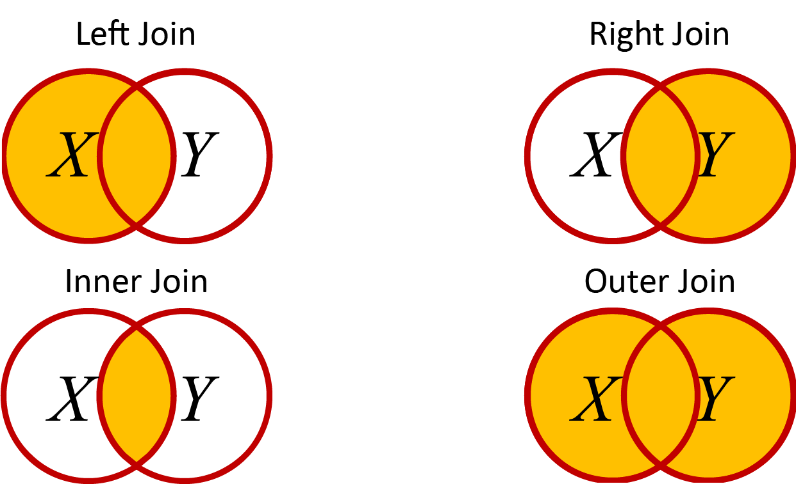
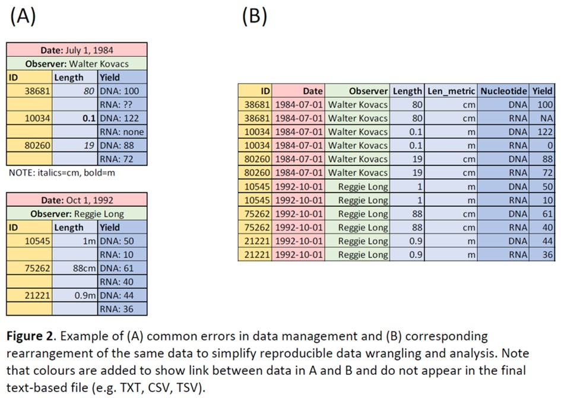

\newpage

# Data Science

## Setup

If you don't have it installed, then run `install.packages("tidyverse")` -- it can take a while to download and install.

The **tidyverse** library is a set of packages created by the same developers responsible for R Studio. There are a number of packages and functions that improve on base R. The name is based on the idea of living in a data universe that is neat and *tidy*. 

The book [R for Data Science](http://shop.oreilly.com/product/0636920034407.do) by Hadley Wickham & Garrett Grolemund is an excellent resource for learning about the tidyverse. In this chapter we'll touch on a few of the main packages and functions. 

> **Protip** In general, any book by Hadley Wickham that you come across is worth reading if you want to be proficient in R.

While we wait for the `tidyverse` to install, let's consider a few general principles of data science.

## Introduction to Data Science

Data Science is a relatively new field of study that merges **computer science** and **statistics** to answer questions in other domains  (e.g. business, medicine, biology, psychology). Data Science as a discipline has grown in popularity in response to the rapid rate of increase in data collection and publication. 

Data Science often involves 'Big Data', which doesn't have a strict quantitative definition but will usually have one or more of the following characteristics:

  1. High **Volume** -- large file sizes with lots of observations.
  2. Wide **Variety** -- lots of different types
  3. High **Velocity** -- accumulating at a high rate
  4. Compromised **Veracity** -- variable quality that must be dealt otherwise downstream analyses will be compromised.

> What are some examples of 'big data' in Biology?

Medical records, remote sensing data (e.g. climate stations, satellite images), and 'omics data are good examples of 'big data' in biology.

In biology, it can be helpful to think of Data Science as a continuous life-cycle with multiple stages:

### Data Science Life-Cycle

  1. **Hypothesize** -- Make initial observations of about the natural world, or insights from other data, that lead to testable hypotheses. Your core biology training is crucial here.
  2. **Collect** -- This may involve taking measurements yourself, manually entering data that is not yet in electronic format, requesting data from authors of published studies, or importing data from online sources. Collecting data is a crucial step that is often done poorly. Some tips on this are provided in a [paper by Wu et al](https://www.biorxiv.org/content/early/2018/10/30/457051)
  3. **Correct** -- Investigate the data for quality assurance, to identify and fix potential errors. Start to visualize the data to look for outliers or nonsensical relationships (or lack thereof).
  4. **Explore** -- Try to understand the data, where they come from, and potential limitations on their use. Continue visualizing data; this may cause you to modify your hypotheses slightly.
  5. **Model** -- Now that hypotheses are clearly defined, apply statistical tests of their validity.
  6. **Report** -- Use visualizations along with the results of your statistical tests to summarize your findings.
  7. **Repeat** -- Return to step 1.

In this tutorial, we focus mainly on coding in R for steps 2, 3, and 6. Step 5 requires a firm understanding of statistics. Step 4 is covered in the tutorials on [qplot](./2_qplot.html) and [ggplot](./3_ggplot.html). Step 1 is everything covered in a typical degree in the biological sciences. 

Data collection and management are crucial steps in the Data Science Life-Cycle. Read the `baRcodeR` paper by [Wu et al](https://www.biorxiv.org/content/early/2018/10/30/457051). called *baRcodeR with PyTrackDat: Open-source labelling and tracking of biological samples for repeatable science.* Pay particular attention to the '*Data Standards*' section. The *baRcodeR* and *PyTrackDat* programs and their application to current projects may also be of interest.

## 2D Data Wrangling

The `dplyr` library in R has many useful features for importing and reorganizing your data for steps 2, 3 and 4 in the Data Science Life-Cycle outlined above. Don't forget to install the `dplyr` library and load it into memory.

```{r}
library(dplyr)
library(tidyr)
```

> Note: This error message just informs you that `dplyr` uses function or parameter names that are the same as other base or stats packages in R. These base/stats functions are 'masked' meaning that when you run one (e.g. `filter`) then R will run the `dplyr` version rather than the stats version.

We'll work with our FallopiaData.csv dataset, and remind ourselves of the structure of the data

### `tibbles` and `readr()`

We looked at `data.frame` objects in the first chapter as an expansion of *matrices* with a few additional features like column and row names. A `tibble` is the `tidyverse` version of the `data.frame` object and includes a few more useful features. To import a dataset to a `tibble` instead of a `data.frame` object, we use `read_csv` instead of `read.csv`.

```{r}
library(tidyverse)
```

```{r}
Fallo<-read_csv(
  "https://colauttilab.github.io/RCrashCourse/FallopiaData.csv")
str(Fallo)
```

This file is an example of a 2-dimensional data set, which is common in biology. 2D datasets have the familiar row x column layout used by spreadsheet programs like Microsoft Excel or Google Sheets. There are some exceptions, but data in this format should typically follows 3 rules:

  1. Each cell contains a single value
  2. Each variable must have its own column
  3. Each observation must have its own row

Making sure your data are arranged this way will usually make it much easier to work with.

### `filter()` 

Let's subset observations based on value

```{r}
Pot1<-filter(Fallo,PotNum==1)
head(Pot1)
```

### `rename()`

It's possible to change the names of columns in your data. In base R you can use the `names()` function with the square bracket index `[]`:

```{r}
X<-Fallo
names(X)
names(X)[12]<-"Total_Biomass"
names(X)
```

There is also a simple `dplyr` function to do this:

### `rename()`

```{r}
X<-rename(Fallo, Total_Biomass = Total)
names(X)
```

### `arrange()` 

Use the `arrange()` function to sort the *rows* of your data based on the *columns* of your data. For example, let's re-arrange our FallopiaData.csv dataset based on Taxon (a string denoting the species of Fallopia used) and Total (a float denoting the total biomass in each pot).

```{r}
X<-arrange(Fallo, Taxon, Total)
head(X)
```

use the `desc()` function with `arrange()` to change reverse alphabetical order, or use `-` to sort from low to high

```{r}
X<-arrange(Fallo, desc(Fallo), Taxon, -Total)
head(X)
```

### `select()` 

The `select()` function can be used to select a subset of columns (i.e. variables) from your data.

Suppose we only want to look at total biomass, but keep all the treatment columns:

```{r}
X<-select(Fallo, PotNum, Scenario, Nutrients, Taxon, Total)
head(X)
```

You can also use the colon `:` to select a range of columns:

```{r}
X<-select(Fallo, PotNum:Taxon, Total)
head(X)
```

Exclude columns with `-`

```{r,error=T}
X<-select(Fallo, -PotNum:Taxon, -Total)
```

> Oops, what generated that error? Take a careful look at the error message and see if you can figure it out.

The problem is we are using the range of columns between PotNum and Taxon, but in one case we are excluding and the other we are including. We need to keep both the same:

```{r}
X<-select(Fallo, -PotNum:-Taxon, Total)
head(X)
```

Or a bit more clear:

```{r}
X<-select(Fallo, -(PotNum:Taxon), Scenario)
head(X)
```

### `everything()`

Use the `everything()` function with `select()` to rearrange your columns without losing any:

```{r}
X<-select(Fallo, Taxon, Scenario, Nutrients, PotNum, 
          Pct_Fallopia, everything())
head(X)
```

### `mutate()`

Suppose we want to make a new column (variable) to our data.frame object (dataset) that is the sum of biomass of Urtica and Geranium only. In base R you would use `$`:

```{r}
X<-Fallo
X$UrtSil<-X$Urtica+X$Silene
```

In the dplyr package you can use mutate

```{r}
X<-mutate(Fallo, UrtSil = Urtica + Silene)
head(X)
```

This is a lot more readable, especially when you have complicated equations or you want to add lots of new columns.

> What if you only wanted to retain the new columns and delete everything else? Try it.

Which functions did you use?

### `transmute()`

You can also use `transmute()` instead of `mutate()` + `select()`

```{r}
X<-transmute(Fallo, UrtSil = Urtica + Silene)
head(X)
```

### `summarize()` + `group_by()`

This can be useful for quickly summarizing your data, for example to find the mean or standard deviation based on a particular treatment or group.

```{r}
TrtGrp<-group_by(Fallo,Taxon,Scenario,Nutrients)
summarize(TrtGrp, Mean=mean(Total), SD=sd(Total))
```

### Weighted Mean

In our dataset, the **Taxon** column shows which of two species of *Fallopia* were used in the competition experiments. We might want to take the mean total biomass for each of the two *Fallopia* species:

```{r}
X<-group_by(Fallo,Taxon)
summarize(X, Mean=mean(Total), SD=sd(Total))
```

However, there are other factors in our experiment that may affect biomass. The *Nutrients* column tells us whether pots received high or low nutrients, and this also affects biomass:

```{r}
X<-group_by(Fallo,Nutrients)
summarize(X, Mean=mean(Total), SD=sd(Total))
```

Now imagine if our sampling design is 'unbalanced'. For example, maybe we had some plant mortality or lost some plants to a tornado. If one of the two species in the *Taxon* column had more high-nutrient pots, then it would have a higher mean. BUT, the higher mean is not an effect of the Taxon, but is simply due to the unbalanced nature of the design. We can simulate this effect by re-shuffling the species names:

```{r}
RFallo<-Fallo
set.seed(256)
RFallo$Taxon<-rbinom(nrow(RFallo),size=1,prob=0.7)

X<-group_by(RFallo,Taxon)
summarize(X, Mean=mean(Total))
```

To fix this problem, we may want to take a *weighted mean*:

```{r}
X1<-group_by(RFallo,Taxon,Scenario,Nutrients)
Y1<-summarize(X1,Mean=mean(Total))
X2<-group_by(Y1,Taxon,Scenario)
Y2<-summarize(X2,Mean=mean(Mean))
X3<-group_by(Y2,Taxon)
Y3<-summarize(X3, Mean=mean(Mean))
arrange(Y3,desc(Mean))
```

### `%>%` (pipe)

The combination `%>%` is called 'pipe' for short. Be careful though -- in Unix, 'pipe' is slightly different and uses the vertical line (often shift-backslash): `|`

The pipe is useful to combine operations without creating a whole bunch of new objects. This can save on memory use. 

> Use `Ctl` + `Shift` + `m` to add a pipe quickly

For example, we can re-write the weighted mean example using pipes:

```{r}
RFallo %>% 
  group_by(Taxon,Scenario,Nutrients) %>% 
  summarize(Mean=mean(Total)) %>% 
  group_by(Taxon,Scenario) %>% 
  summarize(Mean=mean(Mean)) %>% 
  group_by(Taxon) %>% 
  summarize(Mean=mean(Mean)) %>% 
  arrange(desc(Mean))
```

This also avoids potential for bugs in our program. Imagine if we mis-spelled 'Taxon' in our second line by accidentally pressing 's' along with 'x'. Compare the output:

```{r,error=T}
X<-group_by(Fallo,Taxon,Scenario,Nutrients)
X<-group_by(X,Tasxon,Scenario)
X<-group_by(X,Taxon)
X<-summarize(X, Mean=mean(Total), SD=sd(Total))
arrange(X,desc(Mean))
```

```{r, error=T}
Fallo %>% 
  group_by(Taxon,Scenario,Nutrients) %>%
  group_by(Tasxon,Scenario) %>%
  group_by(Taxon) %>%
  summarize(Mean=mean(Total), SD=sd(Total)) %>%
  arrange(desc(Mean))
```

In both cases we get an error, but in one case we still calculate the means and sd of the two species. 

> A bug that produces no output is much less dangerous than an error that gives an output. Why?

## Join datasets

The `dplyr` package has some handy tools for joining datasets. There are four main ways to join datasets, similar to a Venn diagram. You can get more information on these with the help command `?join` after loading the dplyr library, but here is a quick overview. For each of these, imagine a Venn diagram with two datasets: $X$ as a circle on the left side and $Y$ as a circle on the right side. The rows we choose to combine from the two datasets depend on one or more identifying columns that we can define (e.g. sample ID, date, time).



`left_join()` - Keep all rows of $X$ and add matching rows from $Y$. Any rows in $Y$ that don't match $X$ are excluded.

`right_join()` - The reverse of `left_join()`

`inner_join()` - Only keep rows that are common to **both** $X$ **AND** $Y$. Remove any rows that don't match.

`full_join()` - Keep **any** columns that are in **either** $X$ **OR** $Y$.

To try these out, we can create a couple of quick datasets and compare the output. For each case, note the addition of NA for missing data.

```{r}
X<-data.frame(ID=c("A","C"),Xdat=c(1,3))
Y<-data.frame(ID=c("B","C"),Ydat=c(2,3))
X
Y
left_join(X,Y,by="ID")
right_join(X,Y,by="ID")
inner_join(X,Y,by="ID")
full_join(X,Y,by="ID")
```

## Wide vs Long data

Most of the data examples we've looked at are in the 'wide' format, where we have a single individual as a row, and multiple measurements as separate columns.

However, there are many cases where we may want to reorganize our data into the 'long' format, where each row is an individual observation. Many statistical models use this format, and it's also useful for visualizations. For example, if we have a bunch of columns of data and we want to generate histograms quickly, we can use `facet_` functions from ggplot2 if our data is in the long format. 

### `pivot_longer`

The `pivot_longer()` function in the `tidyr` library does this. We use the `cols=` parameter to specify the data columns, then `names_to=` specifies the column name containing the parameter, and the `cols_to=` specifies the column name of the values. 

This is a bit confusing to read, but it's easier to understand if you compare the output with the `full_join` function above.

```{r}
LongData<-full_join(X,Y,by="ID") %>%
  pivot_longer(cols=c("Xdat","Ydat"),
               names_to="Measurement",
               values_to="Value")
LongData
```

Note how there is only 1 column of data values, with the `Measurement` column indicating which measurement the value belongs to, and the `ID` column is repeated for each measurement.

This is why the *long* data format is sometimes called the *repeated measures* data format.

### `pivot_wider`

The `pivot_wider()` function does the reverse, but this time we specify the column that contains the values with `values_from=` and the corresponding column names with `names_from=`. This should recover the original dataset:

```{r}
WideData<-LongData %>%
  pivot_wider(values_from=Value,
              names_from=Measurement)
WideData
```


## Missing Data

So far we have worked on a pristine data set that has already been edited for errors. More often datasets will contain missing values.

### `NA` and `na.rm()`

The R language uses a special object `NA` to denote missing data. 

```{r}
Vec<-c(1,2,3,NA,5,6,7)
Vec
```

When a function is run on a vector or other object containing NA, the function will often return NA or give an error message:

```{r, error=T}
mean(Vec)
```

This is by design, because it is not always clear what NA means. Many functions in R include an na.rm parameter that is set to FALSE by default. Setting it to true tells the function to ignore the NA

```{r}
mean(Vec, na.rm=T)
```

### `NA` vs `0`

A common mistake students make is to put 0 for missing data. This can be a big problem when analyzing the data since the calculations are very different.

```{r}
Vec1<-c(1,2,3,NA,5,6,7)
mean(Vec1, na.rm=T)
Vec2<-c(1,2,3,0,5,6,7)
mean(Vec2, na.rm=T)
```

### `is.na()`

In large datasets you might want to check for missing values. Let's simulate this in our *FallopiaData.csv* dataset. 

To set up a test dataset, randomly select 10 rows and replace the value for 'Total' with NA. The `sample` function is a 

```{r}
X<-round(runif(10,min=1,max=nrow(Fallo)),0)
Fallo$Total[X]<-NA
Fallo$Total
```

Use `is.na()` to check for missing values:

```{r}
is.na(Fallo$Total)
```

Note that the output is a vector of True/False. Each cell corresponds to a value of 'Total' with TRUE indicating missing values. This is an example of a boolean variable, which has some handy properties in R. 

First, we can use it as an index. For example, let's see which pots have missing 'Total' values:

```{r}
Missing<-is.na(Fallo$Total)
Fallo$PotNum[Missing]
```

Another handy trick to count missing values is:

```{r}
sum(is.na(Fallo$Total))
```

This takes advantage of the fact that the boolean TRUE/FALSE variable is equivalent to the binary 1/0 values.

## Naughty Data

Naughty data contain the same information as a standard row x column (i.e. 2-dimensional) dataset but break the rules outlined above:

1. Each cell contains a single value
2. Each variable must have its own column
3. Each observation must have its own row

Examples of Naughty Data are shown in Figure 2A of the [Wu et al. manuscript](https://www.biorxiv.org/content/early/2018/10/30/457051).



Naughty data can be very time consuming to fix, but regular expressions can make this a bit easier (see the [Regex tutorial](https://colauttilab.github.io/RCrashCourse/4_regex.html)).

## Dates

As biologists, we often work with dates. We may want to analyze the date a sample was collected, or a measurement was taken. But dates are often encoded in formats that can't be analyzed directly. The `lubridate` package provides a convenient framework for switching between human-readable dates and mathematical relationships among them -- for example, the number of days, minutes, or seconds between two time points.

```{r}
library(lubridate)
```

It can be convenient to automatically include the current date or time, especially when you are producing reports.

We can get the date, which we will call a `date` object

```{r}
today()
```

And we can get the date and time, which we will call a `datetime` object

```{r}
now()
```

This is an important distinction, because the `datetime` object extends on the `date` object to include hours, minutes, seconds, etc.

We can use a `datetime` object to track how long it takes to run a particular program. We first create an object to store the computer clock before the program runs, then we subtract that object from the compter clock afterthe program finishes:

```{r}
Before<-now()

for(i in 1:1000){
  rpois(10,lambda=10)^rnorm(10)
}

now()-Before
```

> **Protip**: Try adding a `print()` function to print out the result in each iteration of the for loop. How much does this slow down the run time?

### `date` Objects

Human-readable dates come in many different forms, which we can encode as strings. Here are some examples that we might see for encoding the end-date of the most recent 5,126-year-long Mesoamerican calendar used by the ancient Maya:

```{r}
Date2<-"2012-12-21"
Date3<-"21.12.2012"
Date4<-"Dec 21, 2012"
Date5<-"21 December, 2012"
```

The `lubridate` package has a number of related functions that correspond to the order of entry -- `d` for day, `m` for month, and `y` for year:

```{r}
ymd(Date2)
dmy(Date3)
mdy(Date4)
dmy(Date5)
```

Notice the flexibility here! Some dates have dashes, dots, spaces, and commas! But all are converted to a common object type. On the surface, these objects look like simple strings, but let's investigate:

```{r}
str(Date2)
str(ymd(Date2))
```

Notice how the first is a simple `chr` character object, whereas the second is a `Date` object. The date object can be treated as a numeric variable, that outputs as a readable date. For example, what if we want to know what the date 90 days before or after?

```{r}
c(ymd(Date2)-90,ymd(Date2)+90)
```

The above examples are single strings, but we can just as easily work with a column in a data frame or any other vector of strings:

```{r}
DateVec<-c("2012-12-21","2012-12-22","2012-12-23")
ymd(DateVec)
```

Because these objects are numeric, we can also use them for plotting:

```{r}
qplot(ymd(DateVec))
```

### `datetime`

The `datetime` object adds a time element to the date with an underscore `_` separating the time elements from the day, encoding . Here are a couple of examples

```{r}
mdy_h("Dec 21, 2012 -- 10am")
ymd_hm("2012-12-21, 08:30")
dmy_hms("21 December, 2012; 11:59:59")
```

### Extracting Components 

We can extract components from date objects

```{r}
year(Date2)
month(Date2)
```

We have several options for days.

First, we can get the day of the year, also known as the Julian day:

```{r}
yday(Date2)
```

Or the day of the month

```{r}
mday(Date2)
```

or the day of the week (rather than month) using `wday()`

```{r}
wday(Date2)
```

We can use the `label=T`parameter with the above, to get the specific month or day

```{r}
month(Date2, label=T)
wday(Date2, label=T)
```

### Categorical dates  

We've seen above how dates are more like `numeric` rather than `strings`, but we can also treat dates as categorical data. 

One example that is becoming more and more common in biology is the analysis of data from data loggers, which automatically save observations over time. Think of climate stations that measure temperature and precipitation as a common example. Another example might be location information of a study organism using image analysis or PIT tags (i.e. Passive Integrated Transponders).

In many cases, the timescale of collection is much shorter than what we need. Luckily, `dplyr` with `lubridate` are great tools for summarizing these data!

> Example: imagine we have observations taken every minute, and we just want to calculate the average for each hour in R. We can generate a toy dataset in R using the tibble function, and then assigning column names: DayTime for the day-time object and Obs for the observation (i.e. measurement):

First, we create the imaginary dataset, using the replicate function and the a random number generator:

```{r}
TestData<-tibble(
  DayTime=now()+minutes(rep(c(0:359),100)),
  Obs=rnorm(36000))
```

We can calculate the hourly average by piping our TestData tibble (above) through a group_by and then a summarize function.

```{r}
TestData %>%
  group_by(yday(DayTime),hour(DayTime)) %>%
  summarize(Mean=mean(Obs))
```

> **Question** Why do we include `yday` in the group_by function. 

**HINT**: Try removing `yday(DayTime)` and compare the output


