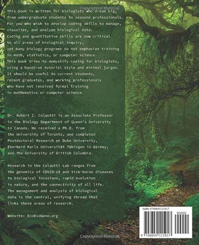

# R Crash Course for Biologists

This is the repository for the book *R Crash Course for Biologists*, which is available in several formats:

  * [Hardcover (Colour ~$40 USD)](#Hard-Cover-Link)
  * [Paperback (B&W ~$20 USD)](#Paperback-Link)
  * [Kindle eBook (~$10 USD)](#Kindle-Link)
  * [A download in PDF format (free)](#Downloads)
  * [A download in ePUB format (free)](#Downloads)
  * [R markdown files for each chapter (free)](#Downloads)

**Disclaimer**: This book is a work in progress. We are able to release this content for free (online) and at a limited cost (print + e-book) by avoiding large publishers and costly services including proofreaders and copy editors. Please expect more errors than a traditional publisher, and help us improve the content.

**Support Us**: Book purchases support future content development including proofreading, language translation, and new print and online content. 

For the latest news, see:

[EcoEvoGeno](https://EcoEvoGeno.org)

 

## Chapter Content
  
  1. R Fundamentals
  2. Basic Graphics
  3. Advanced Graphics
  4. Regular Expressions
  5. Intro to Data Science
  6. Advanced (Markdown, Functions, Packages)
  
## Hard Cover Link

**Sorted alphabetically** 

  * [Australia](https://www.amazon.com.au/dp/B0BCD698BQ?ref_=pe_3052080_397514860)
  * [Brazil](https://www.amazon.com.br/dp/B0BCD698BQ?ref_=pe_3052080_397514860)
  * [Canada](https://www.amazon.ca/dp/B0BCD698BQ?ref_=pe_3052080_397514860)
  * [France](https://www.amazon.fr/dp/B0BCD698BQ?ref_=pe_3052080_397514860)
  * [Germany](https://www.amazon.de/dp/B0BCD698BQ?ref_=pe_3052080_397514860)
 * [India](https://www.amazon.in/dp/B0BCD698BQ?ref_=pe_3052080_397514860)
  * [Italy](https://www.amazon.it/dp/B0BCD698BQ?ref_=pe_3052080_397514860)
  * [Mexico](https://www.amazon.com.mx/dp/B0BCD698BQ?ref_=pe_3052080_397514860)
  * [Netherlands](https://www.amazon.nl/dp/B0BCD698BQ?ref_=pe_3052080_397514860)
  * [Spain](https://www.amazon.es/dp/B0BCD698BQ?ref_=pe_3052080_397514860)
  * [USA](https://www.amazon.com/dp/B0BCD698BQ?ref_=pe_3052080_397514860)
  * [UK](https://www.amazon.co.uk/dp/B0BCD698BQ?ref_=pe_3052080_397514860)
  
## Paperback Link

**Sorted alphabetically** 

  * [Australia](https://www.amazon.com.au/dp/B0BMSZSVN7/ref=sr_1_1?crid=WWP8K5UVF1SK&keywords=R+Crash+Course+for+Biologists)
  * [Brazil](https://www.amazon.com.br/dp/B0BMSZSVN7/ref=sr_1_1?crid=WWP8K5UVF1SK&keywords=R+Crash+Course+for+Biologists)
  * [Canada](https://www.amazon.ca/dp/B0BMSZSVN7/ref=sr_1_1?crid=WWP8K5UVF1SK&keywords=R+Crash+Course+for+Biologists)
  * [France](https://www.amazon.fr/dp/B0BMSZSVN7/ref=sr_1_1?crid=WWP8K5UVF1SK&keywords=R+Crash+Course+for+Biologists)
  * [Germany](https://www.amazon.de/dp/B0BMSZSVN7/ref=sr_1_1?crid=WWP8K5UVF1SK&keywords=R+Crash+Course+for+Biologists)
  * [India](https://www.amazon.in/dp/B0BMSZSVN7/ref=sr_1_1?crid=WWP8K5UVF1SK&keywords=R+Crash+Course+for+Biologists)
  * [Italy](https://www.amazon.it/dp/B0BMSZSVN7/ref=sr_1_1?crid=WWP8K5UVF1SK&keywords=R+Crash+Course+for+Biologists)
  * [Mexico](https://www.amazon.com.mx/dp/B0BMSZSVN7/ref=sr_1_1?crid=WWP8K5UVF1SK&keywords=R+Crash+Course+for+Biologists)
  * [Netherlands](https://www.amazon.nl/dp/B0BMSZSVN7/ref=sr_1_1?crid=WWP8K5UVF1SK&keywords=R+Crash+Course+for+Biologists)
  * [Spain](https://www.amazon.es/dp/B0BMSZSVN7/ref=sr_1_1?crid=WWP8K5UVF1SK&keywords=R+Crash+Course+for+Biologists)
  * [USA](https://www.amazon.com/dp/B0BMSZSVN7/ref=sr_1_1?crid=WWP8K5UVF1SK&keywords=R+Crash+Course+for+Biologists)
  * [UK](https://www.amazon.co.uk/dp/B0BMSZSVN7/ref=sr_1_1?crid=WWP8K5UVF1SK&keywords=R+Crash+Course+for+Biologists)
  
## Kindle Link

**Sorted alphabetically** 

  * [Australia](https://www.amazon.com.au/Crash-Course-Biologists-bioinformatics-biostatistics-ebook/dp/B0BCDVRRF2)
  * [Brazil](https://www.amazon.com.br/Crash-Course-Biologists-bioinformatics-biostatistics-ebook/dp/B0BCDVRRF2)
  * [Canada](https://www.amazon.ca/Crash-Course-Biologists-bioinformatics-biostatistics-ebook/dp/B0BCDVRRF2)
  * [France](https://www.amazon.fr/Crash-Course-Biologists-bioinformatics-biostatistics-ebook/dp/B0BCDVRRF2)
  * [Germany](https://www.amazon.de/Crash-Course-Biologists-bioinformatics-biostatistics-ebook/dp/B0BCDVRRF2)
  * [India](https://www.amazon.in/Crash-Course-Biologists-bioinformatics-biostatistics-ebook/dp/B0BCDVRRF2)
  * [Italy](https://www.amazon.it/Crash-Course-Biologists-bioinformatics-biostatistics-ebook/dp/B0BCDVRRF2)
  * [Mexico](https://www.amazon.com.mx/Crash-Course-Biologists-bioinformatics-biostatistics-ebook/dp/B0BCDVRRF2)
  * [Netherlands](https://www.amazon.nl/Crash-Course-Biologists-bioinformatics-biostatistics-ebook/dp/B0BCDVRRF2)
  * [Spain](https://www.amazon.es/Crash-Course-Biologists-bioinformatics-biostatistics-ebook/dp/B0BCDVRRF2)
  * [USA](https://www.amazon.com/Crash-Course-Biologists-bioinformatics-biostatistics-ebook/dp/B0BCDVRRF2)
  * [UK](https://www.amazon.co.uk/Crash-Course-Biologists-bioinformatics-biostatistics-ebook/dp/B0BCDVRRF2)
  
## Downloads

Look in the file list here on GitHub for `RCrashCourse.pdf` or `RCrashCourse.epub`, or any of the specific `*.Rmd` chapters in R Markdown format.

## Visitors

 **Total Visits** since Dec 30, 2022

 **Unique Visits** since Dec 30, 2022

(**Note**: ~8k visits from ~4k unique visitors on *GitHub insights* before Dec 30, 2022)
