# Advanced Visualizations

## Overview

Before following this tutorial, you should be familiar with the [qplot() tutorial](https://colauttilab.github.io/RCrashCourse/2_qplot.html), and you should have lots of practice making graphs with different formatting options using `qplot`.

In this self-tutorial, we look at some more advanced options for visualizations by using the `ggplot` function. The 1`ggplot` function adds even more flexibiliity and possibilities to our visualizations.

The [ggplot cheat sheet](https://rstudio.com/wp-content/uploads/2015/03/ggplot2-cheatsheet.pdf) is a downloadable pdf that provides a good summary and quick-reference guide for advanced graphics.

## Getting Started

We'll load the ggplot2 library and set a custom theme as described in the [qplot Tutorial](https://colauttilab.github.io/RCrashCourse/2_qplot.html)


```r
library(ggplot2)
source("http://bit.ly/theme_pub")
theme_set(theme_pub())
```

The `source` function loads an external file, in this case from the internet. The file is just a .R file with a custom function defining different aspects of the graph (e.g. text size, line width, etc.) You can open the link in a web browser or download and open in a text editor to see the file.

The `theme_set()` command sets our custom theme (`theme_pub`) as the default plotting theme. Since the theme is a function in R, we need the extra brackets: `theme_pub()`

<br>

***

<br>

## Rules of thumb

Standards of practice for published graphs in professional journals can vary depending on format and discipline, but there are a number of useful 'rules of thumb' to keep in mind. These are not hard and fast rules but helpful for new researchers who aren't sure how or where to start.

### 1. Minimize 'ink'

In the old days, when most papers were actually printed and mailed to journal subscribers, black ink was expensive and printing in colour was very expensive. Printing is still expensive but of course most research articles are available online where there is no additional cost to colour or extra ink. However, the concept of minimizing ink (or pixels) can go a long way toward keeping a graph free from clutter and unnecessary distraction.

### 2. Use space wisely

Empty space is not necessarily bad, but ask yourself if it is necessary and what you want the reader to take away. Consider the next two graphs:

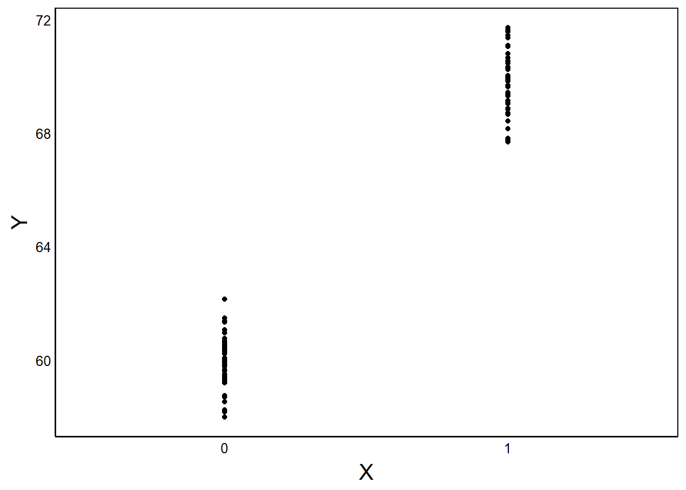

> Above: Y-axis scaled to the data

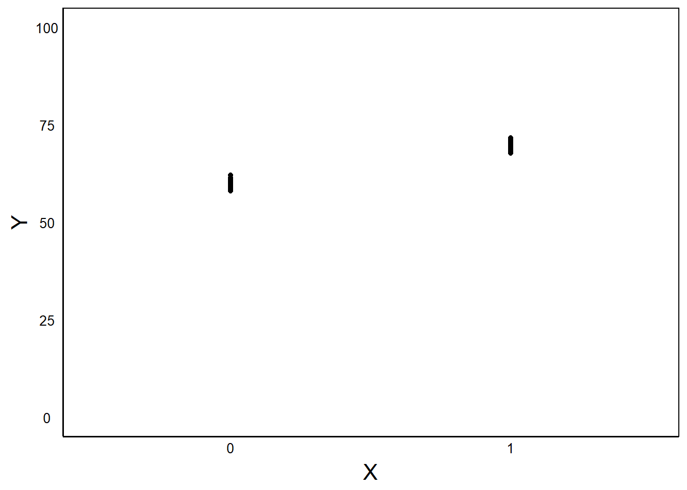

> Above: Y-axis scaled between 0 and 100

What are the benefits/drawbacks of scaling the axes? When might you choose to use one over ther other?

### 3. Choose a colour palette

Colour has three basic components

  a. Hue -- the amount of red vs green vs blue light
  b. Saturation -- how vivid the colour is 
  c. Brightness -- the amount of white (vs black) in the colour
  
In R these can be easily defined with the `rgb()` function. For example:

`rgb(1,0,0)` -- a saturated red
`rgb(0.1,0,0)` -- a dark red (low brightness, low saturation)
`rgb(1,0.9,0.9)` -- a light red (high brightness, low saturation)

Don't underestimate the impact of choosing a good colour palette, especially for presentations. Colour theory can get a bit overwhelming but here are a few good websites to help:

  * Quickly generate your own palette using [coolors](https://coolors.co)
  * Use a colour wheel to find complementary colours using [Adobe](https://color.adobe.com/create)
  * Browse some pre-made palettes or create one from a picture [colorfavs](http://www.colorfavs.com)

### 4. Colours have meaning

What's wrong with this graph? 

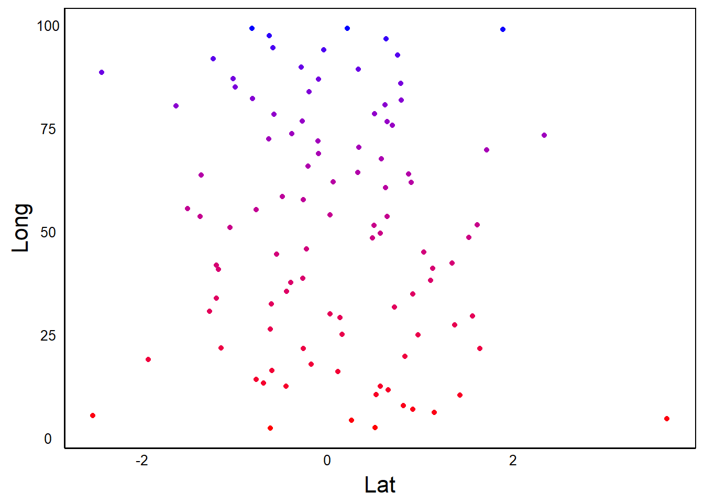

Humans naturally associate colours with particular feelings. Be mindful of these associations when choosing a colour palette

Another important consideration is that not everyone sees colour the same way. About 5% to 10% of the population has colour blindness. In order to make colour graphs readable to everyone, you can use different 

### 5. Maximize contrast

Colours that are too similar will be hard to distinguish

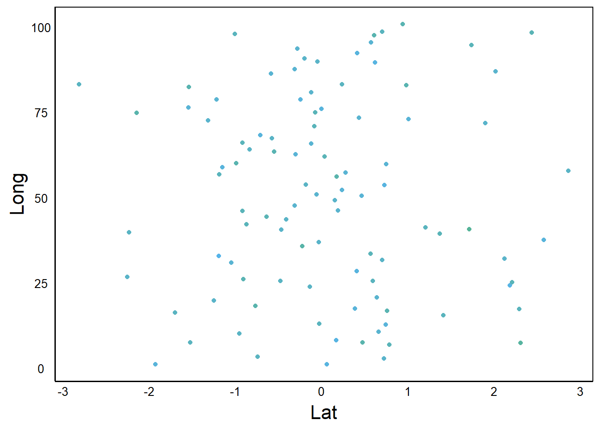

### 6. Keep relevant information

Make sure to include proper axis **labels** (i.e. names) and **tick marks** (i.e. numbers or categories showing the different values). These labels, along with the figure caption, should act as a stand-alone unit. The reader should be able to understand the figure without having to read through the rest of the paper.

### 7. Choose the right graph

Often the same data can be presented in different ways but some are easier to interpret than others. Think carefully about the story you want to present and the main ideas you want your reader to get from your figures. Look at these two graphs that show the same data and see which one is more intuitive


```r
X<-rnorm(100)
Y<-X+rnorm(100)
qplot(c(X,Y),fill=c(rep("X",100),rep("Y",100)),posit="dodge")
```

```
## `stat_bin()` using `bins = 30`. Pick better value with `binwidth`.
```

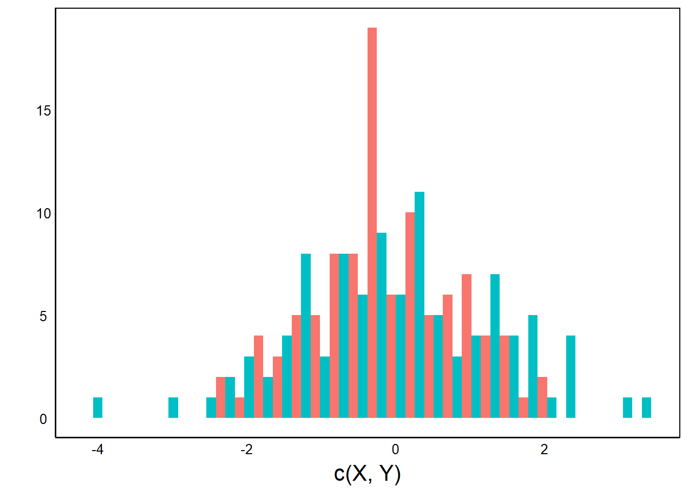

```r
qplot(X,Y)
```

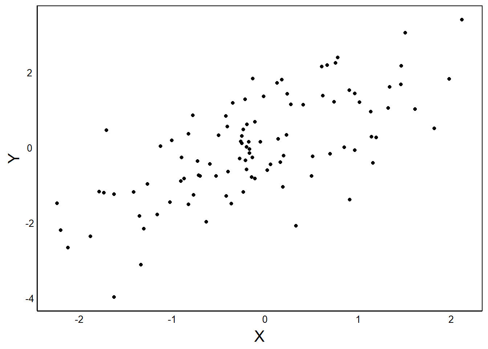

<br>

***

<br>

## Example

To get to know ggplot better, let's do a step-by-step example of a figure published in a [paper by Colautti & Lau](https://doi.org/10.1111/mec.13162) in the journal Molecular Ecology (2015)

### Setup

#### Import data

Download selection dataset from Colautti & Lau (2015), published in the journal **Molecular Ecology**: https://doi.org/10.1111/mec.13162

The paper is a meta-analysis and review of evolution occurring during biological invasions. in this tutorial, we'll recreate Figure 2, which shows the result of a meta-analysis of selection gradients ($\beta$) and selection differentials ($\s$). First, we'll just recreate the top panel, and then we'll look at ways to make more advanced multi-panel graphs like this one.

The data from the paper are archived on Dryad: https://datadryad.org/stash/dataset/doi:10.5061/dryad.gt678

You could downoad the zip file and look for the file called `Selection_Data.csv` and save it to your working directory. 

Or you can just download directly from this website:


```r
SelData<-read.csv("https://colauttilab.github.io/RCrashCourse/Selection_Data.csv",
                  header=T)
```

We are also going to change the names from the file to make them a bit more intuitive and easier to work with in R.


```r
names(SelData)<-c("Collector", "Author", "Year", "Journal", "Vol", 
                  "Species", "Native", "N", "Fitness.measure", "Trait", "s", 
                  "s.SE", "s.P", "B", "B.SE", "B.P")
```


### Inspect

Let's take a quick look at the data


```r
head(SelData)
```

```
##           Collector               Author Year             Journal
## 1 KingsolverDiamond Alatalo and Lundberg 1986           Evolution
## 2 KingsolverDiamond Alatalo and Lundberg 1986           Evolution
## 3 KingsolverDiamond Alatalo and Lundberg 1986           Evolution
## 4 KingsolverDiamond       Alatalo et al. 1990 American Naturalist
## 5 KingsolverDiamond       Alatalo et al. 1990 American Naturalist
## 6 KingsolverDiamond       Alatalo et al. 1990 American Naturalist
##              Vol             Species Native    N       Fitness.measure
## 1     40:574-583  Ficedula hypoleuca    yes  641   male mating success
## 2     40:574-583  Ficedula hypoleuca    yes  713 female mating success
## 3     40:574-583  Ficedula hypoleuca    yes 1705              survival
## 4 135(3):464-471 Ficedula albicollis    yes <NA>              survival
## 5 135(3):464-471 Ficedula albicollis    yes <NA>              survival
## 6 135(3):464-471 Ficedula albicollis    yes <NA>              survival
##           Trait     s s.SE s.P     B B.SE B.P
## 1 tarsus length -0.01       ns    NA         
## 2 tarsus length  0.01      sig    NA         
## 3 tarsus length  0.04       ns    NA         
## 4  tarus length  0.02       ns -0.06         
## 5  tarus length  0.08       ns -0.01         
## 6  tarus length  0.19      sig  0.01
```

It's worth taking some time to look at this to understand how a meta-analysis works. The **collector** column indicates the paper that the data came from. The **Author** indicates the author(s) of the original paper that reported the data. The **Year**, **Journal**, and **Vol** give information about the publication that the data came from originally.

We can see above the collector `KingsolverDiamond`, which represents a paper from Kingsolver and Diamond that was itself a meta-analysis of natural selection. Most of the studies came from this meta-analysis, but a few of the more recent papers were added by grad students, denoted by initials:


```r
unique(SelData$Collector)
```

```
## [1] "KingsolverDiamond" "JAL"               "DJW"              
## [4] "CPT"
```

**Species** is the study species, and **Native** is its stauts as a binary yes/no variable. **N** is the sample size and **Fitness.measure** is the specific trait that defines fitness. **Trait** is the trait on which selection was measured. Finally, $s$ is the **selection differential** and $\beta$ is the **selection gradient**. Note that these are slopes in units of relative fitness per trait standard deviation. This is explained in more detail below.

### Absolute Value

In this analysis, we are interested in the magnitude but not the direction of natural selection. In other words we would want to treat a slope of -4 the same as a slope of +4 because they have the same magnitude. Therefore, we can replace the $s$ column with $|s|$


```r
SelData$s<-abs(SelData$s)
```

We'll also add a couple of columns with random variables that we can use later to explore additional plotting options. 

First, a column of values sampled from a z-distribution (Gaussian distribution with mean = 0 and sd = 1)


```r
SelData$Rpoint<-rnorm(nrow(SelData)) # Random, normally distributed
```

Second, a columnn of 1 and 0 sampled randomly with equal frequency (p = 0.5)


```r
SelData$Rgroup<-sample(c(0,1),nrow(SelData),replace=T) # Random binary value
```


### Missing values

Note the missing data (denoted NA)


```r
print(SelData$s)
```

We can subset to remove mising data


```r
SelData<-SelData[!is.na(SelData$s),]
```

Recall from the [R Fundamentals Tutorial](https://colauttilab.github.io/RCrashCourse/1_fundamentals.html) that `!` means 'not' or 'invert'

Alternatively, we could use `filter` from dplyr


```r
library(dplyr)
SelData<-SelData %>%
  filter(!is.na(s))
```

There is also has a convenient `drop_na` function in the `tidyr` package


```r
library(tidyr)
SelData<-SelData %>%
  drop_na(s)
```

<br>

***

<br>

## Measuring Selection

A simple analysis of phenotypic selection as proposed by Lande & Arnold (1983) is just a linear model with **relative fitness** on the y-axis and the **standardized trait value** on the x-axis. 

### Relative Fitness

**Fitness** can be measured in many ways, such as survival or lifetime seed or egg production. Use `unique(SelData$Fitness.measure)` to see the list of specific fitness measures used in these studies.

**relative fitness** is just the observed or **absolute fitness** divided by the mean. **Absolute fitness** is usually denoted by the capital letter $W$ and **relative fitness** is usually represented by a lower-case $w$ or omega $\omega$. Expressing this in mathematical terms:

$$ \omega = W_i/\bar W $$

### Trait Value

A **Trait Value** is literally just the measured trait. Use `unique(SelData$Trait)` to see the list of specific traits that were measured in these studies. The **Standardized Trait Value** is the traits z-score. See the [Distributions Tutorial](https://colauttilab.github.io/RIntroStats/1_Distributions.html) for more information about z-scores. Since traits have different metrics, they are hard to compare: e.g. days to flower, egg biomass, foraging intensity, aggression. But standardizing traits to z-scores puts them all on the same scale for comparison. Specifically, the scale is in standard deviations from the mean.

### $s$ vs $\beta$

Selection differentials ($s$) and selection gradients ($\beta$) measure selection using linear models but represent slightly different measurements. Linear models are covered in the [Linear Models Tutorial](https://colauttilab.github.io/RIntroStats/3_LinearModels.html).

Both models use relative fitness ($\omega$) as the response variable (Y).

Selection differentials ($s$) measure selection on only a single trait, ignoring all other traits. In theory, the response to selection is a simple function of the genetic correlation between a trait and fitness. Some of this theory, with examples in R, is covered in the [Population Genetics Tutorials](https://colauttilab.github.io/PopGen/3_PopGenFUN_II.html#Natural_Selection).

Fitness differences among individuals can depend on a lot of things -- genetic variation for the trait itself, but also environmental effects on the trait as well as effects on other traits that are under selection and correlated with the trait of interest.

Selection gradients ($\beta$) measure selection on a trait of interest while also accounting for selection on other correlated traits. This is done via a **multiple regression** -- a linear model with multiple predictors.


<br>

***

<br>

## `ggplot`  vs  `qplot`

We can create the same graph using qplot and ggplot, just the syntax changes.

### Histogram

Compare this `qplot`


```r
BarPlot<-qplot(s, data=SelData, fill=Native, geom="bar")
print(BarPlot)
```

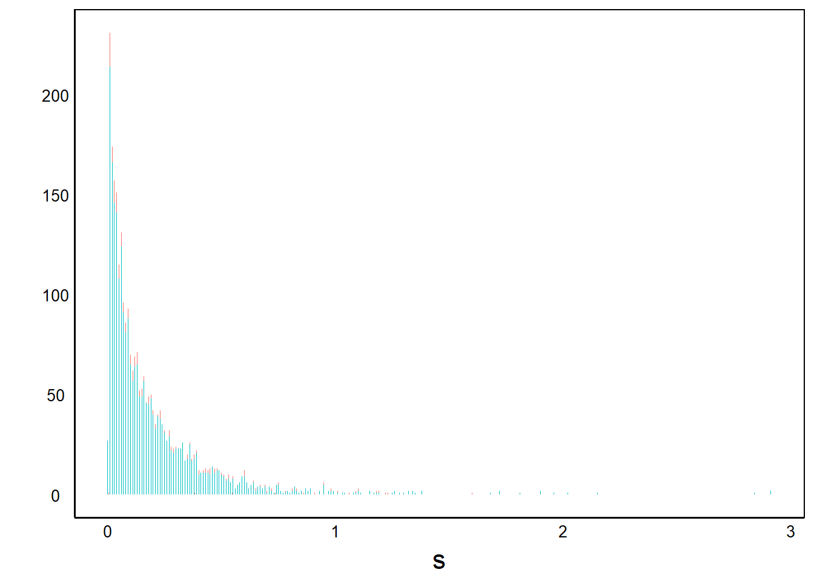

with this `ggplot`


```r
BarPlot <-ggplot(aes(s, fill=Native), data=SelData) 
```

### `aes`

Note the use of the aesthetic funciton `aes()`. This defines the data that we want to use for our `ggplot` graph. We will see how we do this by adding layers to our plot, similar to the way old-timey cartoons were made by layering multiple clear pages of cellphane with painting on them. The `aes` function inside of the `ggplot` function defines that data that will be shared among all of the layers. In addition, we can have separate `aes` functions inside different `geom_` layers that define and restrict the plotting data to that specific layer. 

Let's look at the `ggplot` object so far:


```r
print(BarPlot)
```

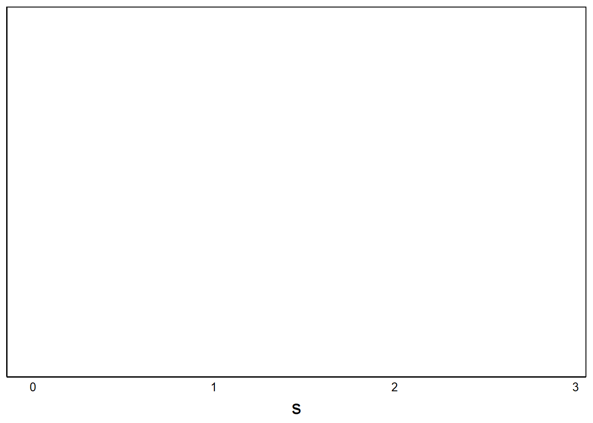

No data! This is one key difference between `qplot` and `ggplot`. The former has default `geoms` that it applies depending on the type of input data. We can modify geoms with the `geom='NAME'` parameter in `qplot`, where 'NAME' is the specific name of the geom we want to use.

In `ggplot` we have to explictly define the geoms using `geom_NAME` where name is the specific name of the geom -- the same text that would go in quotation marks for the geom in `qplot`. The advantage of using `ggplot` is that its easier to creat multiple, overlapping layers with different geoms from types data sources.

### Layers 

So far, we have only loaded in the data info for plotting. We have to specify which geom(s) we want


```r
BarPlot<- BarPlot + geom_bar() # info from ggplot() passed to geom_bar()
BarPlot
```


Explore the components of our BarPlot object:


```r
summary(BarPlot)
```

```
## data: Collector, Author, Year, Journal, Vol, Species, Native, N,
##   Fitness.measure, Trait, s, s.SE, s.P, B, B.SE, B.P, Rpoint, Rgroup
##   [2766x18]
## mapping:  x = ~s, fill = ~Native
## faceting: <ggproto object: Class FacetNull, Facet, gg>
##     compute_layout: function
##     draw_back: function
##     draw_front: function
##     draw_labels: function
##     draw_panels: function
##     finish_data: function
##     init_scales: function
##     map_data: function
##     params: list
##     setup_data: function
##     setup_params: function
##     shrink: TRUE
##     train_scales: function
##     vars: function
##     super:  <ggproto object: Class FacetNull, Facet, gg>
## -----------------------------------
## geom_bar: width = NULL, na.rm = FALSE, orientation = NA
## stat_count: width = NULL, na.rm = FALSE, orientation = NA
## position_stack
```

This shows us the columns of data available, the mapping for our x and y axes, and our fill colours. It also shows some of the functions and parameters used to generate the graph. At the bottom we see parameters for `geom_bar` and `stat_count`. Note that there are more parameters than the ones we defined. These are the **default parameters**.

### `stat_NAME`

If geoms are the geometry of the shapes in the plt, stats are the statistics or mathematical functions that create the geoms. In the above case, the bars in `geom_bar` are created by counting the number of observations in each bin. The `stat_count` function is responsible for this calculation, and it is called by default when we use the `geom_bar` function.

Just as we can change the geometry of the plotted shapes with `geom_NAME`, we can define different functions for generating shapes with `stat_NAME`. Luckily, there is a default stat for each geom, so we don't have to choose it unless we want something other than the default. 

For more information on the parameters and stast of `geom_bar()`


```r
?geom_bar
```

### Bivariate geom

Let's explroe a few more plotting options. Here we'll use the random normal values we generated above so that we can make a bivariate plot:


```r
BivPlot<-ggplot(data=SelData, aes(x=s, y=Rpoint)) + geom_point()
print(BivPlot)
```

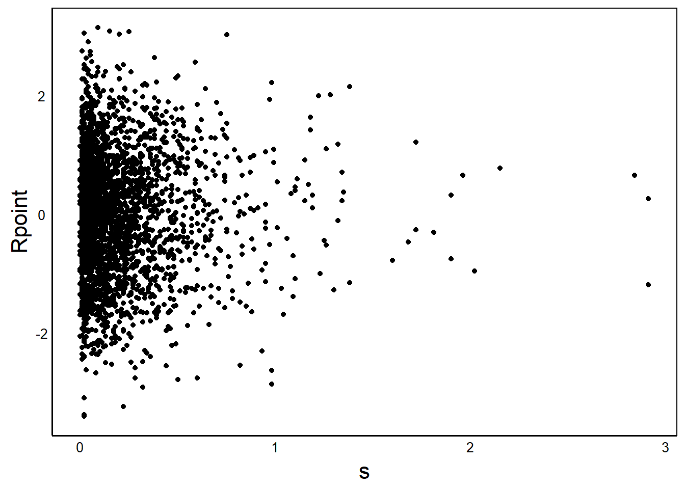

Notice how the points are all clustered to the left. This looks like a classic log-normal variable, so let's log-transform $s$ (x-axis)


```r
BivPlot<-ggplot(data=SelData, aes(x=log(s+1), y=Rpoint)) + geom_point()
print(BivPlot)
```

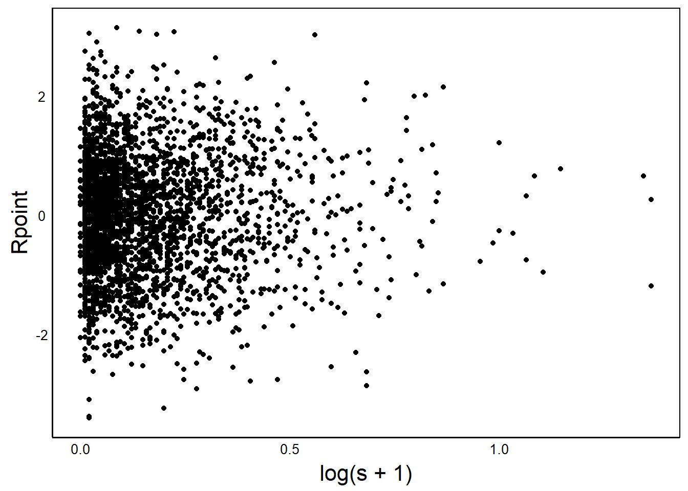

### `geom_smooth`

A really handy feature of `ggplot` is the `geom_smooth` function with several options for calculating and plotting a statistical model to the observations.

Here's a simple linear regression slope:


```r
BivPlot + geom_smooth(method="lm",colour="steelblue",size=2)
```

```
## `geom_smooth()` using formula 'y ~ x'
```

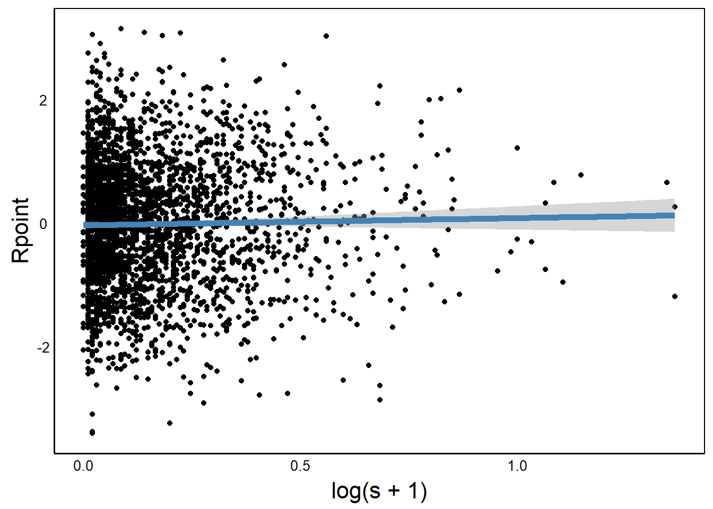

We can use a grouping variable to add separate regression lines for each group


```r
BivPlot + geom_smooth(method="lm",size=2,aes(group=Native,colour=Native))
```

```
## `geom_smooth()` using formula 'y ~ x'
```

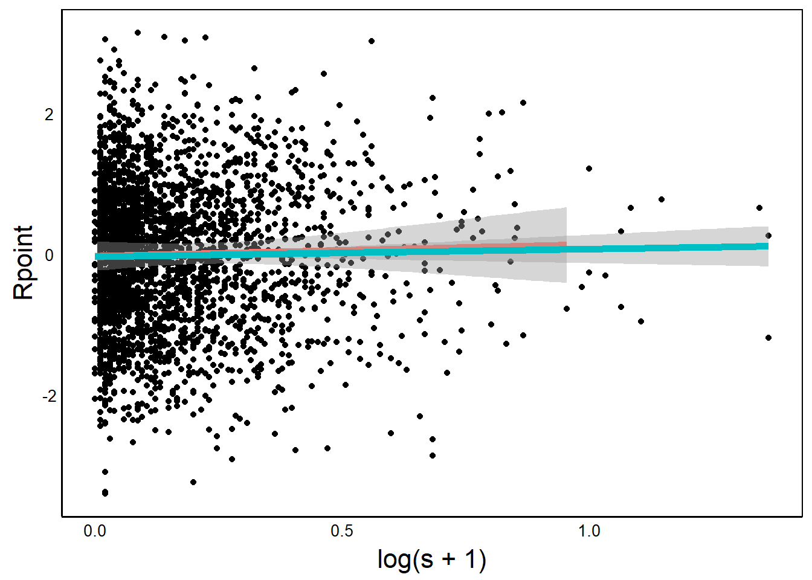

<br>

***

<br>

## Full ggplot

Now that we've done a bit of exploration, let's try to recreate the selection histograms from Colautti & Lau:

  1. Create separate data for native vs. introduced species
  2. Use a bootstrap to estimate non-parametric mean and 95% confidence intervals
  3. Plot all of the components on a single graph

### Separate data


```r
NatSVals<-SelData$s[SelData$Native=="yes"] # s values for Native species
IntSVals<-SelData$s[SelData$Native=="no"] # s values for Introduced species
```

### Bootstrap

The graph includes a bootstrap model to estimate the mean and variance for each group (native=yes vs no). Bootstrapping is covered in the [Bootstrapping and Randomization Tutorial](https://colauttilab.github.io/EcologyTutorials/bootstrap.html). The example below is not the most efficient approach but it applies the flow control concepts covered in the [R Fundamentals Tutorial](https://colauttilab.github.io/RCrashCourse/1_fundamentals.html)

#### Data Setup

First we define the number of iterations and set up two objects to hold the data from our bootstrap loops.


```r
IterN<-100 # Number of iterations
NatSims<-{} # Dummy objects to hold output
IntSims<-{}
```

#### `for` loop

Here we apply our `for` loop. in each round, we:

  1. Sample, with replacement and calculate average
  2. Store average in `NatSims` (native species) or `IntSims` (non-native species)


```r
for (i in 1:IterN){
  NatSims[i]<-mean(sample(NatSVals,length(NatSVals),replace=T))
  IntSims[i]<-mean(sample(IntSVals,length(IntSVals),replace=T))
}
```

#### 95% CI

Confidence Intervals (CI) are calculated from the bootstrap output.

First, sort the datea from low to high


```r
NatSims<-sort(NatSims)
IntSims<-sort(IntSims)
```

Each of the objects contains a number of values equal to our `Iter` variable defined above. Now we identify the lower 2.5% and upper 97.5% values in each vector. For example, with 1000 iterations our 2.5% would be the 25th value in the sorted vector and the upper 97.5% would be the 975th value in the sorted vector.

We use this number to index the vector with square brackets. We make sure to round to a whole number since we can't have a fractional cell position. 


```r
CIs<-c(sort(NatSims)[round(IterN*0.025,0)], # Native, lower 2.5%
       sort(NatSims)[round(IterN*0.975,0)], # Native, upper 97.5%
       sort(IntSims)[round(IterN*0.025,0)], # Intro, lower 2.5%
       sort(IntSims)[round(IterN*0.975,0)]) # Intro, upper 97.5%
```

### Plot data

We'll combine the separate bootstrap vectors into a single data.frame object to make it easier to incorporate into our `ggplot` functions.


```r
HistData<-data.frame(s=SelData$s,Native=SelData$Native)
```

Now we can add layers to the plot. We'll print out each layer as we go, so that we can see what each layer does. The coding is a bit complex here, so don't worry if it's hard to follow everything. The key thing to understand here is how the different geoms contribute to the final plot as individual 'layers'. 


```r
p <- ggplot() + theme_classic()
p <- p + geom_freqpoly(data=HistData[HistData$Native=="yes",], aes(s,y=(..count..)/sum(..count..)),alpha = 0.6,colour="#1fcebd",size=2)
print(p) # native species histogram
```

```
## `stat_bin()` using `bins = 30`. Pick better value with `binwidth`.
```

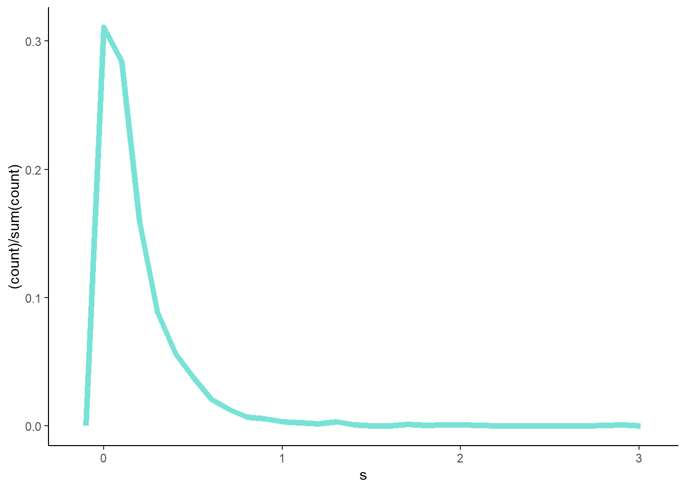

```r
p <- p + geom_freqpoly(data=HistData[HistData$Native=="no",], aes(s,y=(..count..)/sum(..count..)),alpha = 0.5,colour="#f53751",size=2)
print(p) # introduced species histogram
```

```
## `stat_bin()` using `bins = 30`. Pick better value with `binwidth`.
## `stat_bin()` using `bins = 30`. Pick better value with `binwidth`.
```

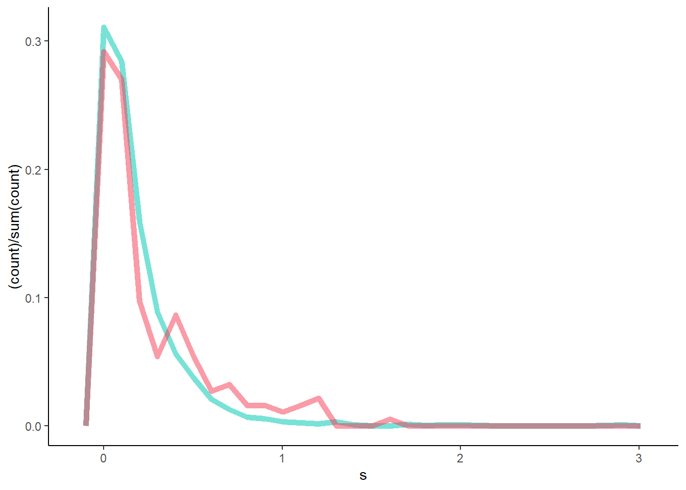

```r
p <- p + geom_rect(aes(xmin=CIs[1],xmax=CIs[2],ymin=0,ymax=0.01),colour="white",fill="#1fcebd88")
print(p) # native species 95% CI bar
```

```
## `stat_bin()` using `bins = 30`. Pick better value with `binwidth`.
## `stat_bin()` using `bins = 30`. Pick better value with `binwidth`.
```


```r
p <- p + geom_line(aes(x=mean(NatSims),y=c(0,0.01)),colour="#1d76bf",size=1)
print(p) # native species bootstrap mean
```

```
## `stat_bin()` using `bins = 30`. Pick better value with `binwidth`.
## `stat_bin()` using `bins = 30`. Pick better value with `binwidth`.
```


```r
p <- p + geom_rect(aes(xmin=CIs[3],xmax=CIs[4],ymin=0,ymax=0.01),colour="white",fill="#f5375188")
print(p) # introduced species 95% CI bar
```

```
## `stat_bin()` using `bins = 30`. Pick better value with `binwidth`.
## `stat_bin()` using `bins = 30`. Pick better value with `binwidth`.
```

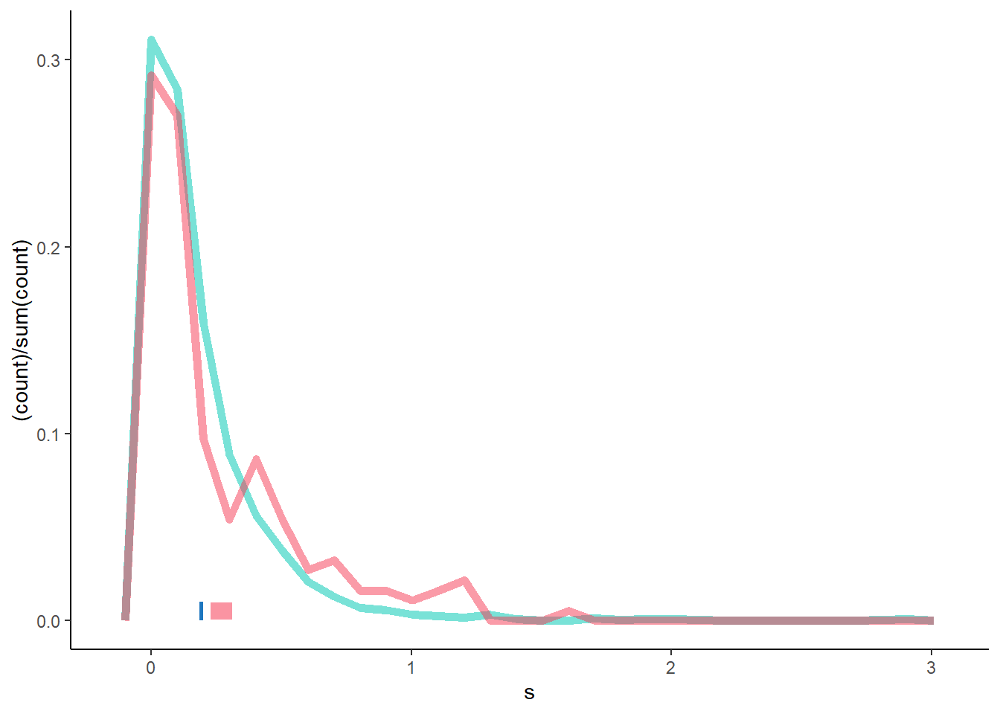

```r
p <- p + geom_line(aes(x=mean(IntSims),y=c(0,0.01)),colour="#f53751",size=1)
print(p) # introduced species bootstrap mean
```

```
## `stat_bin()` using `bins = 30`. Pick better value with `binwidth`.
## `stat_bin()` using `bins = 30`. Pick better value with `binwidth`.
```

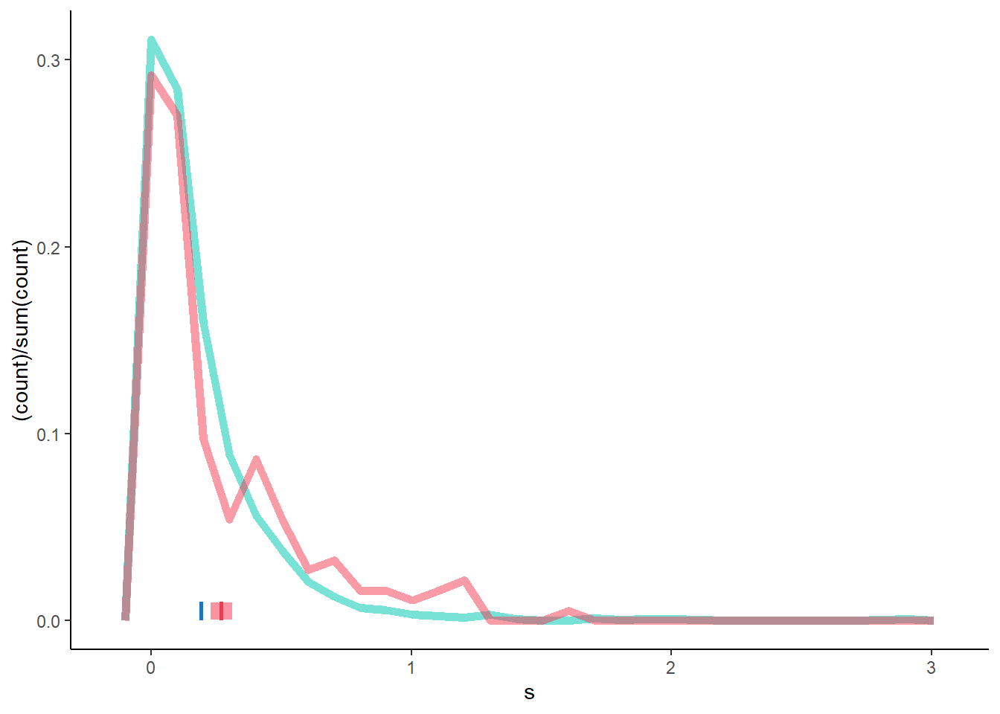

```r
p <- p + ylab("Frequency") + scale_x_continuous(limits = c(0, 1.5))
print(p) # labels added, truncated x-axis
```

```
## `stat_bin()` using `bins = 30`. Pick better value with `binwidth`.
```

```
## Warning: Removed 12 rows containing non-finite values (stat_bin).
```

```
## `stat_bin()` using `bins = 30`. Pick better value with `binwidth`.
```

```
## Warning: Removed 1 rows containing non-finite values (stat_bin).
```

```
## Warning: Removed 2 row(s) containing missing values (geom_path).

## Warning: Removed 2 row(s) containing missing values (geom_path).
```

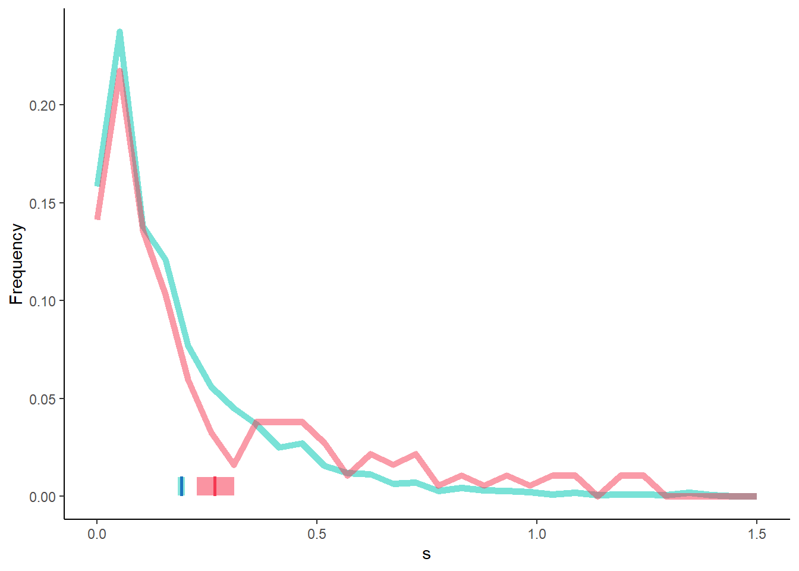

Another important point to note is that case we leave the `ggplot()` function empty because each geom uses different data. The data for each geom is defined by separate `aes` functions inside of each geom.

<br>

***

<br>

## Multi-graph

In the [qplot Tutorial](https://colauttilab.github.io/RCrashCourse/2_qplot.html) we saw a quick and easy way to make multiple graphs for different groups using the `facets` parameter.

### `facets`

We can also use facets with `gpplot`, just using a slightly different syntax giving a couple of options: 

  1. `facet_grid` lets us define a grid and set the vertical and horizontal variables
  2. `facet_wrap` is a convenient option if only have one categorical variable but many categories
  
NOTE: one little tricky part of facets with `ggplot` is that it uses `vars` instead of the `aes` function to indicate which categorical variables from the original dataset should be used to subset the graphs.

Returning to the `BivPlot` example above:


```r
BivPlot<-ggplot(data=SelData, aes(x=log(s+1), y=Rpoint)) + 
  geom_point() 
BivPlot + facet_grid(rows=vars(Native), cols=vars(Collector))
```

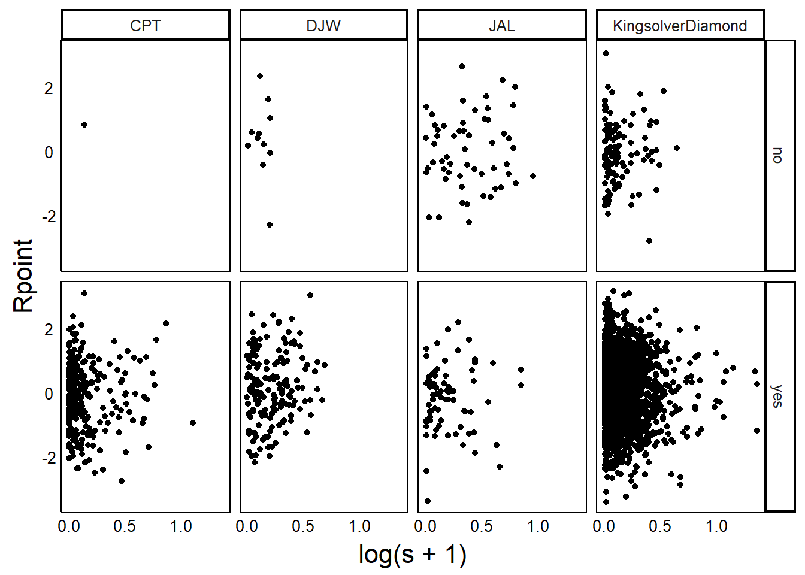


```r
BivPlot<-ggplot(data=SelData, aes(x=log(s+1), y=Rpoint)) + 
  geom_point() 
BivPlot + facet_wrap(vars(Year))
```

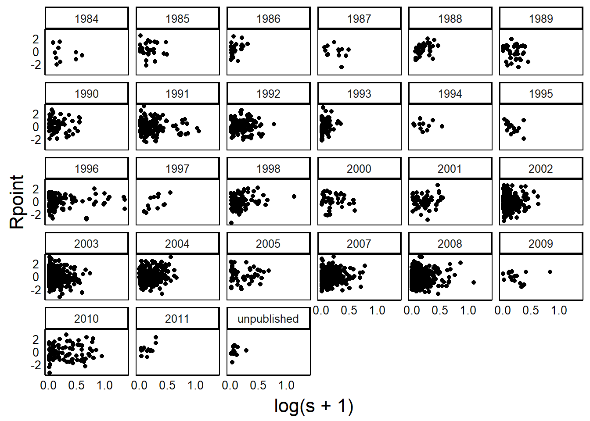

### `grid.extra` package

Facets produce graphs with the same x- and y-axes. We might call these 'homogenous' plots because they use the same axes and they are all the same size. For publications though, we might want to includ 'heterogeneous' plots with different axes and different sizes. The `gridExtra` package provides options for this.

Install 'gridExtra' with `install.packages("gridExtra")`


```r
library(gridExtra)
```

#### `grid.arrange()`

Use this to combine heterogeous ggplot objects into a single multi-panel plot.

Note that this will print ghe graphs graphs down rows, then across columns, from top left to bottom right. You can use `nrow` and `ncol` to control the layout in a grid format. 


```r
HistPlot<-p # Make a more meaningful name
grid.arrange(HistPlot,BivPlot,BarPlot,ncol=1)
```

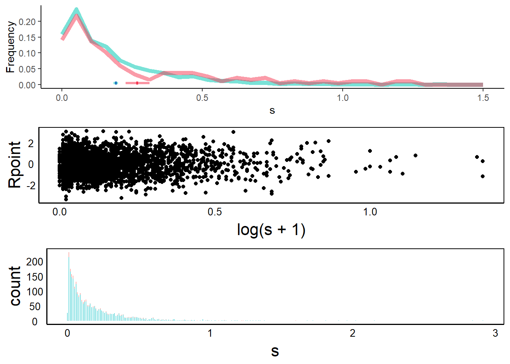

```r
grid.arrange(HistPlot,BivPlot,BarPlot,nrow=2)
```

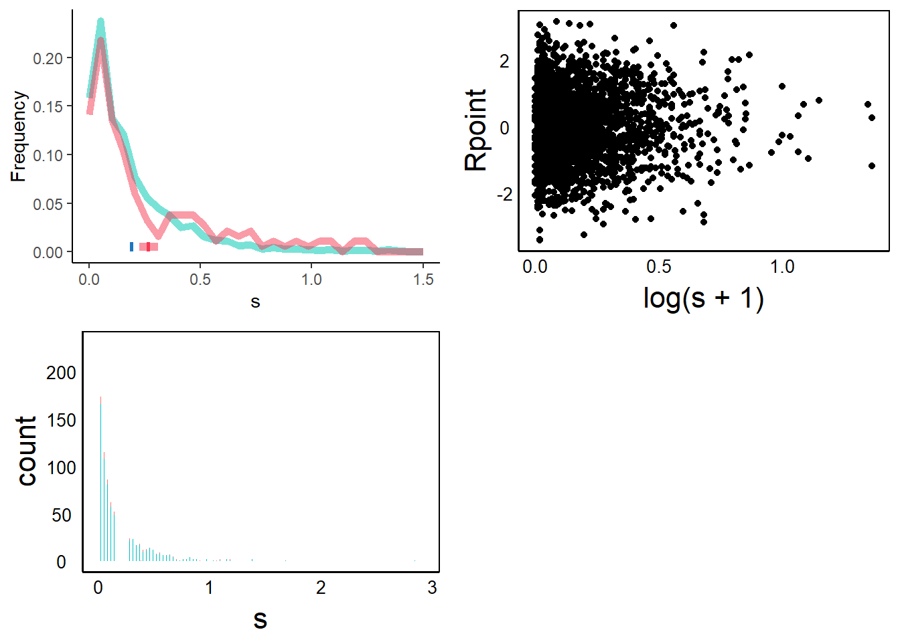

> Note: You might get some warnings based on missing values or wrong binwidth. You will also see some weird things with different text sizes in the graphs. Normally, you would want to fix these for a final published figure but here we are just focused on showing what is possible with the layouts.

### `grid` package

What if we want to have graphs of different sizes? Or what if we want one figure to be inside another? We can make some even more advanced graphs using the `grid` package. 


```r
library(grid)
```

First, we set up the plotting area with `grid.newpage`


```r
grid.newpage() # Open a new page on grid device
```

To insert a new graph on top (or inside) the current graph, we use `pushViewport` to set up an imaginary plotting grid. In this case, imagine breaking up the plotting space into 3 rows by two columsn.


```r
pushViewport(viewport(layout = grid.layout(3, 2))) # Create 3x2 grid layout
```


Finally, we print each `ggplot` object, specifying which grid(s) to plot in.


```r
print(HistPlot, vp = viewport(layout.pos.row = 3, layout.pos.col = 1:2)) # Add fig in row 3 and across columns 1:2
print(BivPlot, vp = viewport(layout.pos.row = 1:2, layout.pos.col = 1)) # add fig acros rows 1:3 in column 1
print(BarPlot, vp = viewport(layout.pos.row = 1:2, layout.pos.col = 2))
```


#### Inset

We can also use `pushViewport` to set up a grid for plotting on top of an existing graph or image. This can be used to generate a figure with an inset.


```r
HistPlot
pushViewport(viewport(layout = grid.layout(4, 4))) # Create 4x4 grid layout (number of cells, will determine size/location of graph)
print(BivPlot, vp = viewport(layout.pos.row = 1:2, layout.pos.col = 3:4))
```

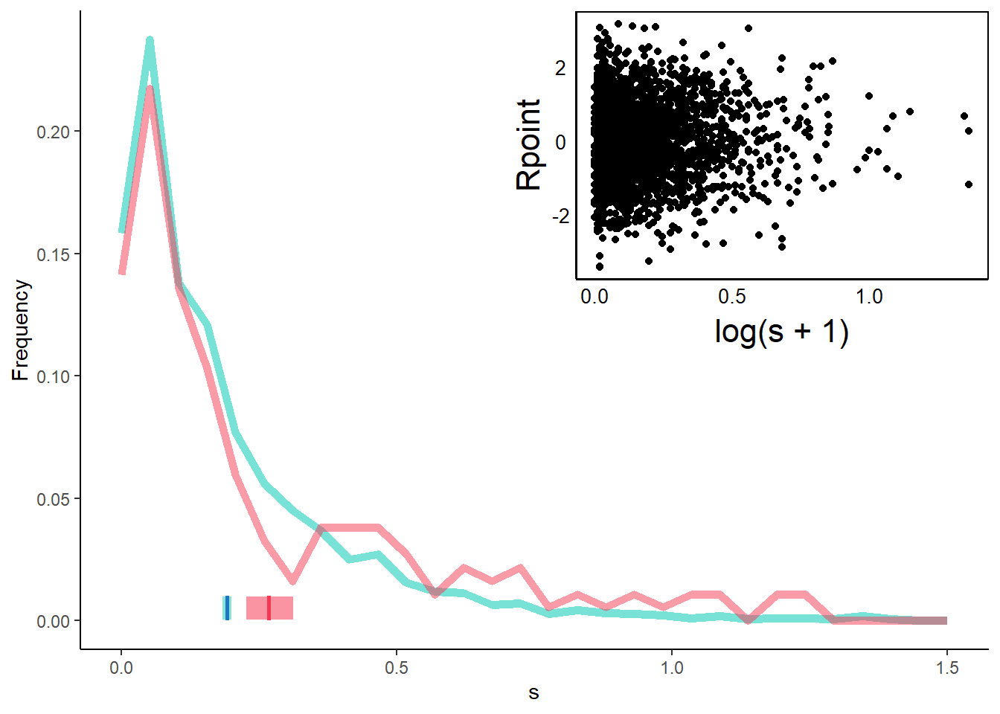

<br>

***

<br>

## Further Reading

The 2009 book *ggplog2: Elegant Graphics for Data Analysis* by Hadly Wickham is the definitive guide to all things ggplot. 

A physical copy is published by Springer
http://link.springer.com/book/10.1007%2F978-0-387-98141-3

And there is a free ebook version: https://ggplot2-book.org/


